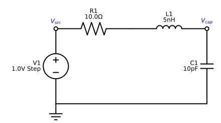
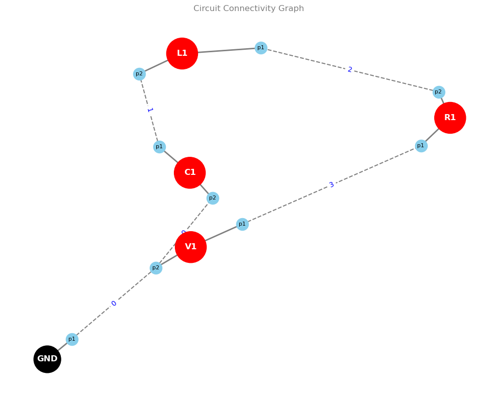
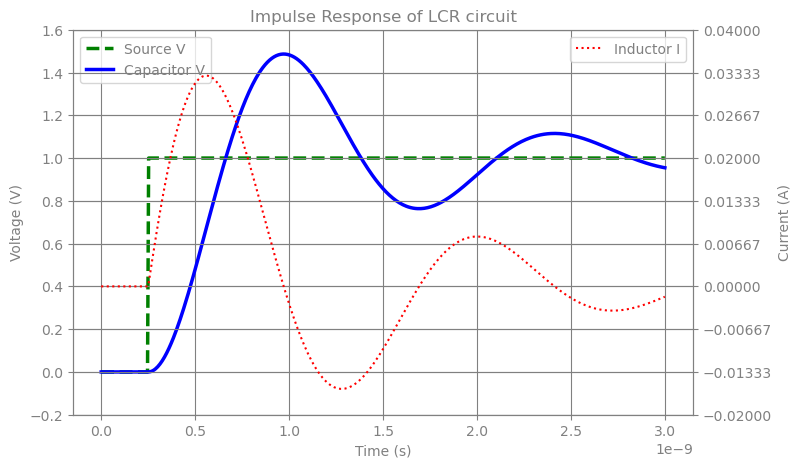

# LRC Circuit

## Introduction

In this example, we simulate a classical Series RLC Circuit operating in the Gigahertz (RF) regime. The circuit consists of a voltage source, a resistor ($10\Omega$), an inductor ($5\text{nH}$), and a capacitor ($10\text{pF}$) connected in series.

The behavior of the circuit is determined by the relationship between the resistance ($R$) and the critical damping resistance, defined as $ R_{c} = 2\sqrt{L/C}$

For this specific configuration:

* **Critical Resistance ($R_c$)**: $2\sqrt{L/C} \approx 44.7\Omega$.
* **Actual Resistance ($R$)**: $10\Omega$.

Since $R < R_c$, the system is underdamped. When the voltage source is activated, energy oscillates—or "sloshes"—between the inductor’s magnetic field and the capacitor’s electric field. This creates a characteristic "ringing" effect (transient oscillation) that gradually decays as the resistor dissipates the energy as heat.


```python
import diffrax
import jax
import jax.numpy as jnp
import matplotlib.pyplot as plt

from circulax.compiler import compile_netlist
from circulax.components.electronic import Capacitor, Inductor, Resistor, VoltageSource
from circulax.solvers import analyze_circuit, setup_transient
```

    KLUJAX_RS DEBUG MODE.


```python
net_dict = {
    "instances": {
        "GND": {"component": "ground"},
        "V1": {"component": "source_voltage", "settings": {"V": 1.0, "delay": 0.25e-9}},
        "R1": {"component": "resistor", "settings": {"R": 10.0}},
        "C1": {"component": "capacitor", "settings": {"C": 1e-11}},
        "L1": {"component": "inductor", "settings": {"L": 5e-9}},
    },
    "connections": {
        "GND,p1": ("V1,p2", "C1,p2"),
        "V1,p1": "R1,p1",
        "R1,p2": "L1,p1",
        "L1,p2": "C1,p1",
    },
}
```





## Visualize the nodes


```python
from circulax.netlist import draw_circuit_graph

draw_circuit_graph(netlist=net_dict);
```





```python
jax.config.update("jax_enable_x64", True)


models_map = {
    "resistor": Resistor,
    "capacitor": Capacitor,
    "inductor": Inductor,
    "source_voltage": VoltageSource,
    "ground": lambda: 0,
}

print("Compiling...")
groups, sys_size, port_map = compile_netlist(net_dict, models_map)

print(port_map)

print(f"Total System Size: {sys_size}")
for g_name, g in groups.items():
    print(f"Group: {g_name}")
    print(f"  Count: {g.var_indices.shape[0]}")
    print(f"  Var Indices Shape: {g.var_indices.shape}")
    print(f"  Sample Var Indices:{g.var_indices}")
    print(f"  Jacobian Rows Length: {len(g.jac_rows)}")

print("2. Solving DC Operating Point...")
linear_strat = analyze_circuit(groups, sys_size, is_complex=False)

y_guess = jnp.zeros(sys_size)
y_op = linear_strat.solve_dc(groups, y_guess)

transient_sim = setup_transient(groups=groups, linear_strategy=linear_strat)
term = diffrax.ODETerm(lambda t, y, args: jnp.zeros_like(y))


t_max = 3e-9
saveat = diffrax.SaveAt(ts=jnp.linspace(0, t_max, 500))
print("3. Running Simulation...")
sol = transient_sim(
    t0=0.0,
    t1=t_max,
    dt0=1e-3 * t_max,
    y0=y_op,
    saveat=saveat,
    max_steps=100000,
    progress_meter=diffrax.TqdmProgressMeter(refresh_steps=100),
)

ts = sol.ts
v_src = sol.ys[:, port_map["V1,p1"]]
v_cap = sol.ys[:, port_map["C1,p1"]]
i_ind = sol.ys[:, 5]

print("4. Plotting...")
fig, ax1 = plt.subplots(figsize=(8, 5))
ax1.plot(ts, v_src, "g--", linewidth=2.5, label="Source V")
ax1.plot(ts, v_cap, "b-", linewidth=2.5, label="Capacitor V")
ax1.set_xlabel("Time (s)")
ax1.set_ylabel("Voltage (V)")
ax1.legend(loc="upper left")

ax2 = ax1.twinx()
ax2.plot(ts, i_ind, "r:", label="Inductor I")
ax2.set_ylabel("Current (A)")
ax2.legend(loc="upper right")

ax2_ticks = ax2.get_yticks()
ax1_ticks = ax1.get_yticks()
ax2.set_yticks(jnp.linspace(ax2_ticks[0], ax2_ticks[-1], len(ax1_ticks)))
ax1.set_yticks(jnp.linspace(ax1_ticks[0], ax1_ticks[-1], len(ax1_ticks)))

plt.title("Impulse Response of LCR circuit")
plt.grid(True)
plt.show()
```

    Compiling...
    {'C1,p1': 1, 'L1,p2': 1, 'GND,p1': 0, 'V1,p2': 0, 'C1,p2': 0, 'R1,p2': 2, 'L1,p1': 2, 'V1,p1': 3, 'R1,p1': 3, 'V1,i_src': 4, 'L1,i_L': 5}
    Total System Size: 6
    Group: source_voltage
      Count: 1
      Var Indices Shape: (1, 3)
      Sample Var Indices:[[3 0 4]]
      Jacobian Rows Length: 1
    Group: resistor
      Count: 1
      Var Indices Shape: (1, 2)
      Sample Var Indices:[[3 2]]
      Jacobian Rows Length: 1
    Group: capacitor
      Count: 1
      Var Indices Shape: (1, 2)
      Sample Var Indices:[[1 0]]
      Jacobian Rows Length: 1
    Group: inductor
      Count: 1
      Var Indices Shape: (1, 3)
      Sample Var Indices:[[2 1 5]]
      Jacobian Rows Length: 1
    2. Solving DC Operating Point...


    3. Running Simulation...


    4. Plotting...





```python

```
