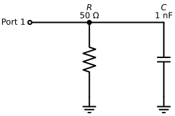
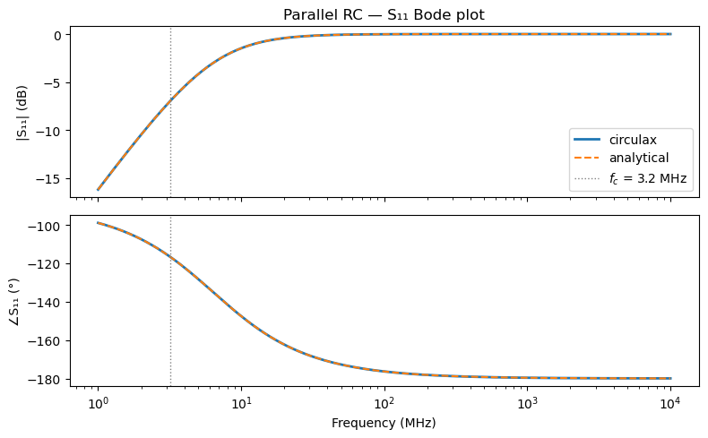
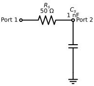
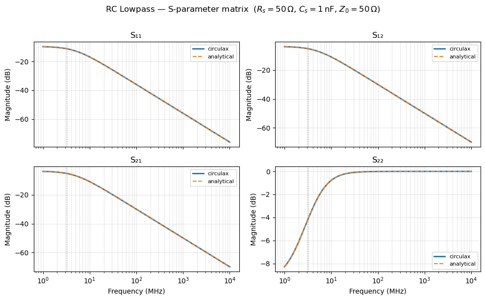
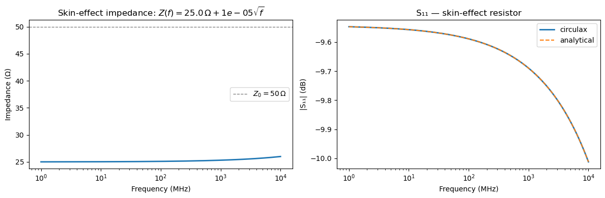

## AC Small-Signal Analysis (S-parameters)

This notebook demonstrates `setup_ac_sweep` on two circuits:

1. **Parallel RC — single port** — a minimal benchmark.  We compare $S_{11}(f)$ against the analytical admittance formula.
2. **Series-R shunt-C lowpass — two ports** — a classic LC prototype filter.  We recover all four S-parameters and verify passivity.
3. **Skin-effect resistor (fdomain component)** — a frequency-dependent component whose impedance $Z(f) = R_0 + a\sqrt{f}$ cannot be expressed as a time-domain DAE; `@fdomain_component` handles it natively.

AC analysis linearises the circuit DAE at the DC operating point and sweeps a range of frequencies:

$$Y(j\omega) = G + j\omega C, \qquad G = \partial F/\partial y\big|_{y_\text{dc}}, \quad C = \partial Q/\partial y\big|_{y_\text{dc}}$$

With $N$ port excitations as columns of the RHS, a single `jnp.linalg.solve` per frequency yields the full $N\times N$ S-matrix at once.


```python
import jax
import jax.numpy as jnp
import matplotlib.pyplot as plt
import numpy as np
import schemdraw
import schemdraw.elements as elm

from circulax import analyze_circuit, compile_netlist, fdomain_component, setup_ac_sweep
from circulax.components.electronic import Capacitor, Resistor

jax.config.update("jax_enable_x64", True)
```

    KLUJAX_RS DEBUG MODE.


---
## Part 1: Parallel RC — Single Port

A resistor $R$ and capacitor $C$ both shunt from the port node to ground.
The circuit admittance is $Y_\text{circuit} = 1/R + j\omega C$, so the analytical $S_{11}$ is:

$$Y_\text{total} = \frac{1}{Z_0} + \frac{1}{R} + j\omega C, \qquad
S_{11} = \frac{2/Z_0}{Y_\text{total}} - 1$$

At DC ($\omega\to 0$) the capacitor is an open circuit.  For $R = Z_0 = 50\,\Omega$ we get the classic matched-load result $S_{11}(0) = 0$.  At high frequencies $C$ short-circuits $R$ so $S_{11} \to -1$.


```python
R = 50.0    # Ω  (shunt resistor = Z0 → matched at DC)
C = 1e-9    # F  (1 nF shunt capacitor)
Z0 = 50.0   # Ω  (reference impedance)

f_c = 1.0 / (2 * np.pi * R * C)   # RC corner frequency
print(f"RC corner frequency: {f_c / 1e6:.3f} MHz")

with plt.style.context(["default", {"axes.grid": True, "figure.facecolor": "white"}]), schemdraw.Drawing() as d:
    d.config(fontsize=12, unit=3.0)
    d.add(elm.Dot(open=True).label("Port 1", loc="left"))
    d.add(elm.Line().right(d.unit * 0.8))
    top = d.here
    d.add(elm.Dot())
    d.add(elm.Resistor().down().label(f"$R$\n{R:.0f} Ω", loc="right"))
    d.add(elm.Ground())
    d.add(elm.Line().right(d.unit).at(top))
    d.add(elm.Capacitor().down().label(f"$C$\n{C*1e9:.0f} nF", loc="right"))
    d.add(elm.Ground())
```

    RC corner frequency: 3.183 MHz





```python
models = {"resistor": Resistor, "capacitor": Capacitor, "ground": lambda: 0}

net_rc = {
    "instances": {
        "GND": {"component": "ground"},
        "R1":  {"component": "resistor",  "settings": {"R": R}},
        "C1":  {"component": "capacitor", "settings": {"C": C}},
    },
    "connections": {
        "R1,p1": "C1,p1",    # shared port node
        "R1,p2": "GND,p1",
        "C1,p2": "GND,p1",
    },
}

groups, num_vars, pmap = compile_netlist(net_rc, models)
solver = analyze_circuit(groups, num_vars)
y_dc = solver.solve_dc(groups, jnp.zeros(num_vars))

port_nodes = [pmap["R1,p1"]]
run_ac = setup_ac_sweep(groups, num_vars, port_nodes, z0=Z0)

freqs = jnp.logspace(6, 10, 300)   # 1 MHz → 10 GHz
S = jax.jit(run_ac)(y_dc, freqs)
S11 = S[:, 0, 0]
print(f"S shape: {S.shape}  (N_freqs, N_ports, N_ports)")
```

    S shape: (300, 1, 1)  (N_freqs, N_ports, N_ports)


```python
# Analytical reference
omega = 2 * jnp.pi * freqs
Y_total = 1.0 / Z0 + 1.0 / R + 1j * omega * C
S11_ref = (2.0 / Z0) / Y_total - 1.0

max_err = float(jnp.max(jnp.abs(S11 - S11_ref)))
print(f"Max |ΔS11| = {max_err:.2e}")

fig, (ax1, ax2) = plt.subplots(2, 1, figsize=(8, 5), sharex=True)

ax1.semilogx(freqs / 1e6, 20 * np.log10(np.abs(S11)),     "C0",  lw=2,   label="circulax")
ax1.semilogx(freqs / 1e6, 20 * np.log10(np.abs(S11_ref)), "C1--", lw=1.5, label="analytical")
ax1.axvline(f_c / 1e6, color="gray", ls=":", lw=1, label=f"$f_c$ = {f_c/1e6:.1f} MHz")
ax1.set_ylabel("|S₁₁| (dB)")
ax1.set_title("Parallel RC — S₁₁ Bode plot")
ax1.legend()

ax2.semilogx(freqs / 1e6, np.degrees(np.angle(S11)),     "C0",  lw=2)
ax2.semilogx(freqs / 1e6, np.degrees(np.angle(S11_ref)), "C1--", lw=1.5)
ax2.axvline(f_c / 1e6, color="gray", ls=":", lw=1)
ax2.set_ylabel("∠S₁₁ (°)")
ax2.set_xlabel("Frequency (MHz)")

plt.tight_layout()
plt.show()
```

    Max |ΔS11| = 4.00e-11





---
## Part 2: RC Lowpass Filter — Two Ports

A series resistor $R_s$ followed by a shunt capacitor $C_s$ forms a first-order lowpass prototype.
With $Z_0$ terminations at both ports the 3 dB cutoff is approximately:

$$f_{\text{3dB}} \approx \frac{1}{2\pi R_s C_s}$$

At low frequencies energy passes through ($|S_{21}| \approx 0\,\text{dB}$); at high frequencies the capacitor short-circuits the output ($|S_{21}| \to -\infty\,\text{dB}$).

Passivity requires $|S_{11}|^2 + |S_{21}|^2 \leq 1$ at all frequencies (for a lossless 2-port with a single incident wave).


```python
R_s = 50.0   # Ω  series
C_s = 1e-9   # F  shunt

f_3dB = 1.0 / (2 * np.pi * R_s * C_s)
print(f"Approximate 3 dB frequency: {f_3dB / 1e6:.3f} MHz")

with plt.style.context(["default", {"axes.grid": True, "figure.facecolor": "white"}]), schemdraw.Drawing() as d:
    d.config(fontsize=12, unit=3.0)
    d.add(elm.Dot(open=True).label("Port 1", loc="left"))
    rs = d.add(elm.Resistor().right().label(f"$R_s$\n{R_s:.0f} Ω"))
    jct = d.here
    d.add(elm.Dot())
    d.add(elm.Dot(open=True).label("Port 2", loc="right"))
    d.add(elm.Capacitor().down().at(jct).label(f"$C_s$\n{C_s*1e9:.0f} nF", loc="right"))
    d.add(elm.Ground())
```

    Approximate 3 dB frequency: 3.183 MHz





```python
# Port 1 is R1,p1 — a large shunt resistor (1 TΩ) registers it as a circuit node
# with negligible effect on the result (contributes 1e-12 S vs 1/Z0 = 0.02 S).
net_lp = {
    "instances": {
        "GND":  {"component": "ground"},
        "Rprobe": {"component": "resistor",  "settings": {"R": 1e15}},  # 1 TΩ port probe
        "R1":   {"component": "resistor",  "settings": {"R": R_s}},
        "C1":   {"component": "capacitor", "settings": {"C": C_s}},
    },
    "connections": {
        "Rprobe,p1": "R1,p1",   # port 1 node
        "Rprobe,p2": "GND,p1",
        "R1,p2":     "C1,p1",   # junction = port 2 node
        "C1,p2":     "GND,p1",
    },
}

groups_lp, num_vars_lp, pmap_lp = compile_netlist(net_lp, models)
solver_lp = analyze_circuit(groups_lp, num_vars_lp)
y_dc_lp = solver_lp.solve_dc(groups_lp, jnp.zeros(num_vars_lp))

port_nodes_lp = [pmap_lp["R1,p1"], pmap_lp["R1,p2"]]
run_ac_lp = setup_ac_sweep(groups_lp, num_vars_lp, port_nodes_lp, z0=Z0)

S_lp = jax.jit(run_ac_lp)(y_dc_lp, freqs)
print(f"S shape: {S_lp.shape}  (N_freqs, 2, 2)")
```

    S shape: (300, 2, 2)  (N_freqs, 2, 2)


```python
# Analytical 2×2 reference: solve the nodal system at each frequency
def _s_analytical_lp(f, R=R_s, C=C_s, Z0=Z0):
    omega = 2 * jnp.pi * f
    Y = jnp.array([
        [1/Z0 + 1/R,  -1/R                    ],
        [-1/R,          1/Z0 + 1/R + 1j*omega*C],
    ], dtype=jnp.complex128)
    RHS = (2.0 / Z0) * jnp.eye(2, dtype=jnp.complex128)  # two port excitations
    V = jnp.linalg.solve(Y, RHS)          # (2, 2): columns = solutions per excitation
    return V - jnp.eye(2, dtype=jnp.complex128)

S_ref_lp = jax.vmap(_s_analytical_lp)(freqs)

print("S-parameter max errors vs analytical:")
for i in range(2):
    for j in range(2):
        err = float(jnp.max(jnp.abs(S_lp[:, i, j] - S_ref_lp[:, i, j])))
        print(f"  S{i+1}{j+1}: {err:.2e}")

# Passivity: |S11|² + |S21|² ≤ 1 (power conservation, port 1 excitation)
col1_power = jnp.abs(S_lp[:, 0, 0])**2 + jnp.abs(S_lp[:, 1, 0])**2
print(f"\nMax |S11|² + |S21|² = {float(jnp.max(col1_power)):.6f}  (must be ≤ 1)")

fig, axes = plt.subplots(2, 2, figsize=(10, 6), sharex=True)

params = [(0, 0, "S₁₁"), (0, 1, "S₁₂"), (1, 0, "S₂₁"), (1, 1, "S₂₂")]
for i, j, label in params:
    ax = axes[i][j]
    ax.semilogx(freqs/1e6, 20*np.log10(np.abs(S_lp[:, i, j])),     "C0",  lw=2,   label="circulax")
    ax.semilogx(freqs/1e6, 20*np.log10(np.abs(S_ref_lp[:, i, j])), "C1--", lw=1.5, label="analytical")
    ax.axvline(f_3dB/1e6, color="gray", ls=":", lw=1)
    ax.set_title(label)
    ax.set_ylabel("Magnitude (dB)")
    ax.legend(fontsize=8)
    ax.grid(True, which="both", alpha=0.3)

for ax in axes[1]:
    ax.set_xlabel("Frequency (MHz)")

plt.suptitle(f"RC Lowpass — S-parameter matrix  ($R_s = {R_s:.0f}\\,\\Omega$, $C_s = {C_s*1e9:.0f}\\,\\text{{nF}}$, $Z_0 = {Z0:.0f}\\,\\Omega$)", y=1.01)
plt.tight_layout()
plt.show()
```

    S-parameter max errors vs analytical:
      S11: 9.99e-12
      S12: 2.00e-11
      S21: 2.00e-11
      S22: 4.00e-11

    Max |S11|² + |S21|² = 0.532210  (must be ≤ 1)





---
## Part 3: Skin-Effect Resistor (`@fdomain_component`)

The skin effect causes the resistance of a conductor to increase with frequency:

$$Z(f) = R_0 + a\sqrt{f}$$

where $R_0$ is the DC resistance and $a$ is a geometry-dependent coefficient.
This impedance has no finite-order rational approximation, so it **cannot be expressed as a finite-dimensional time-domain DAE**.

Using `@fdomain_component`, we define the admittance matrix $Y(f)$ directly.  The AC sweep evaluates it at each frequency point inside the `jax.vmap` loop.


```python
@fdomain_component(ports=("p1", "p2"))
def SkinResistor(f: float, R0: float = 25.0, a: float = 1e-5):
    """Skin-effect resistor: Z(f) = R0 + a·√f  →  Y(f) = 1/Z(f)."""
    Z = R0 + a * jnp.sqrt(jnp.abs(f) + 1e-30)   # 1e-30 regularises f=0
    Y = 1.0 / Z
    return jnp.array([[Y, -Y], [-Y, Y]], dtype=jnp.complex128)


R0, a = 25.0, 1e-5   # Ω,  Ω/√Hz

models_skin = {"skin_r": SkinResistor, "resistor": Resistor, "ground": lambda: 0}

net_skin = {
    "instances": {
        "GND":  {"component": "ground"},
        "SR1":  {"component": "skin_r",  "settings": {"R0": R0, "a": a}},
        "Rbig": {"component": "resistor", "settings": {"R": 1e15}},  # 1 TΩ port probe
    },
    "connections": {
        "SR1,p1":  "Rbig,p1",   # port node
        "SR1,p2":  "GND,p1",
        "Rbig,p2": "GND,p1",
    },
}

groups_sk, num_vars_sk, pmap_sk = compile_netlist(net_skin, models_skin)
solver_sk = analyze_circuit(groups_sk, num_vars_sk)
y_dc_sk = solver_sk.solve_dc(groups_sk, jnp.zeros(num_vars_sk))

run_ac_sk = setup_ac_sweep(groups_sk, num_vars_sk, [pmap_sk["SR1,p1"]], z0=Z0)
S_sk = jax.jit(run_ac_sk)(y_dc_sk, freqs)
S11_sk = S_sk[:, 0, 0]

# Analytical: Z(f) is real so |Γ| = |Z - Z0| / |Z + Z0|
Z_skin = R0 + a * jnp.sqrt(jnp.abs(freqs) + 1e-30)
Y_total_sk = 1.0 / Z0 + 1.0 / Z_skin
S11_sk_ref = (2.0 / Z0) / Y_total_sk - 1.0

max_err_sk = float(jnp.max(jnp.abs(S11_sk - S11_sk_ref)))
print(f"Max |ΔS11| (skin effect) = {max_err_sk:.2e}")

# Show impedance and S11 side by side
fig, (ax1, ax2) = plt.subplots(1, 2, figsize=(12, 4))

ax1.semilogx(freqs / 1e6, np.array(Z_skin), "C0", lw=2)
ax1.set_xlabel("Frequency (MHz)")
ax1.set_ylabel("Impedance (Ω)")
ax1.set_title(f"Skin-effect impedance: $Z(f) = {R0}\\,\\Omega + {a:.0e}\\sqrt{{f}}$")
ax1.axhline(Z0, color="gray", ls="--", lw=1, label=f"$Z_0 = {Z0:.0f}\\,\\Omega$")
ax1.legend()

ax2.semilogx(freqs / 1e6, 20 * np.log10(np.abs(S11_sk)),     "C0",  lw=2,   label="circulax")
ax2.semilogx(freqs / 1e6, 20 * np.log10(np.abs(S11_sk_ref)), "C1--", lw=1.5, label="analytical")
ax2.set_xlabel("Frequency (MHz)")
ax2.set_ylabel("|S₁₁| (dB)")
ax2.set_title("S₁₁ — skin-effect resistor")
ax2.legend()

plt.tight_layout()
plt.show()

print(f"\nS11 at DC   ({float(freqs[0])/1e6:.1f} MHz): {float(jnp.abs(S11_sk[0])):.4f}  (expected {float(jnp.abs(S11_sk_ref[0])):.4f})")
print(f"S11 at 10 GHz: {float(jnp.abs(S11_sk[-1])):.4f}  (expected {float(jnp.abs(S11_sk_ref[-1])):.4f})")
```

    Max |ΔS11| (skin effect) = 1.78e-11





    S11 at DC   (1.0 MHz): 0.3332  (expected 0.3332)
    S11 at 10 GHz: 0.3158  (expected 0.3158)
