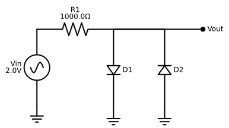

# Diode Clipper

## Introduction

In this example, we will simulate a classic **Diode Clipper (Limiter)** circuit. This circuit is a fundamental building block in analog signal processing, used to protect sensitive components from voltage spikes or to shape waveforms by "clipping" signal peaks.

From a simulation perspective, the Diode Clipper serves as a critical benchmark for testing non-linear solvers. As the input voltage crosses the diode's forward-bias threshold, the component's impedance changes rapidly—spanning orders of magnitude from "off" to "on." This behavior creates a stiff system of differential equations, requiring a robust, adaptive step-size controller to maintain numerical stability.


```python
import time

import diffrax
import jax
import jax.numpy as jnp
import matplotlib.pyplot as plt

from circulax import compile_circuit
from circulax.components.electronic import Diode, Resistor, VoltageSourceAC

jax.config.update("jax_enable_x64", True)

```

    WARNING:2026-06-23 09:42:41,306:jax._src.xla_bridge:864: An NVIDIA GPU may be present on this machine, but a CUDA-enabled jaxlib is not installed. Falling back to cpu.


## Defining the Netlist


```python
vpp = 2.0
net_dict = {
    "instances": {
        "GND": {"component": "ground"},
        "Vin": {
            "component": "source_voltage",
            "settings": {
                "V": vpp,
                "freq": 1e3,
            },
        },
        "R1": {"component": "resistor", "settings": {"R": 1000.0}},
        "D1": {
            "component": "diode",
            "settings": {
                "Is": 1e-14,
            },
        },
        "D2": {
            "component": "diode",
            "settings": {
                "Is": 1e-14,
            },
        },
    },
    "connections": {
        "GND,p1": ("Vin,p2", "D1,p2", "D2,p1"),
        "Vin,p1": "R1,p1",
        "R1,p2": ("D1,p1", "D2,p2"),
    },
    "ports": {"in": "Vin,p1", "out": "R1,p2"},
}

```





```python
models_map = {
    "resistor": Resistor,
    "diode": Diode,
    "source_voltage": VoltageSourceAC,
    "ground": lambda: 0,
}

print("1. Compiling Circuit...")
circuit = compile_circuit(net_dict, models_map, backend="klu_split")
print(f"   System Size: {circuit.sys_size} variables")

print("2. Solving DC Operating Point...")
y_dc = circuit.dc()
print(f"   DC Solution (First 5): {y_dc[:5]}")

print("3. Running Transient Simulation...")

t_max = 2e-3
saveat = diffrax.SaveAt(ts=jnp.linspace(0, t_max, 300))

step_controller = diffrax.PIDController(
    rtol=1e-3,
    atol=1e-6,
    pcoeff=0.2,
    icoeff=0.5,
    dcoeff=0.4,
    force_dtmin=True,
    dtmin=1e-8,
    dtmax=1e-5,
    error_order=2,
)

start = time.time()
sol = circuit.transient(
    t0=0,
    t1=t_max,
    dt0=1e-6 * t_max,
    y0=y_dc,
    saveat=saveat,
    stepsize_controller=step_controller,
)
stop = time.time()

if sol.result == diffrax.RESULTS.successful:
    print("   ✅ Simulation Successful")
    print(f"Performed {sol.stats['num_steps']} steps performed in {stop - start:.2f} seconds")
    ts = sol.ts
    v_in = circuit.port(sol.ys, "in")
    v_out = circuit.port(sol.ys, "out")

    plt.figure(figsize=(8, 4))
    plt.plot(ts * 1000, v_in, "g--", alpha=0.5, linewidth=2, label=f"Input ({vpp} V Sine)")
    plt.plot(ts * 1000, v_out, "r-", linewidth=2, label="Output (Clipped)")
    plt.title("Diode Limiter: Hard Non-Linearity Test")
    plt.xlabel("Time (ms)")
    plt.ylabel("Voltage (V)")
    plt.legend()
    plt.grid(True)
    plt.show()
else:
    print("   ❌ Simulation Failed")
    print(f"   Result Code: {sol.result}")

```

    1. Compiling Circuit...


       System Size: 4 variables
    2. Solving DC Operating Point...
       DC Solution (First 5): [0. 0. 0. 0.]
    3. Running Transient Simulation...


       ✅ Simulation Successful
    Performed 591 steps performed in 0.65 seconds


```python

```
