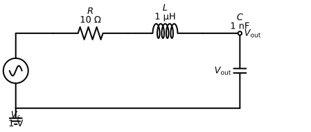
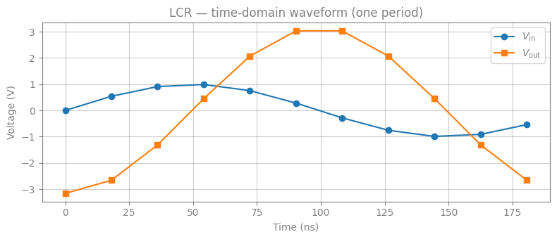
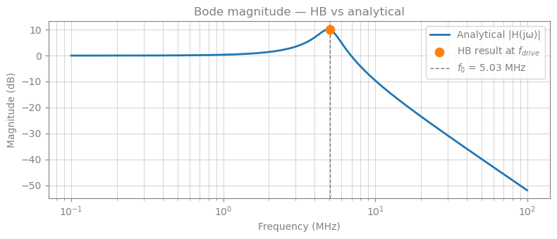
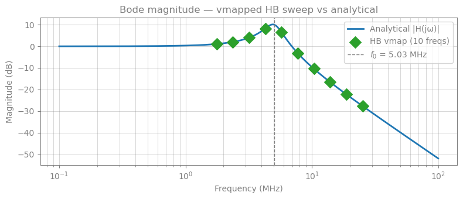
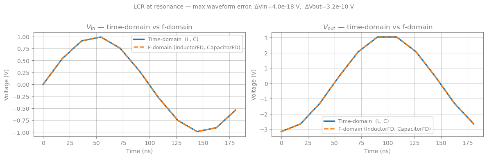
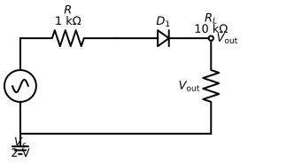
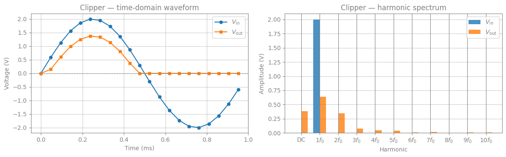

## Harmonic Balance Analysis

This notebook demonstrates the Harmonic Balance (HB) solver on two circuits:

1. **Series LCR resonator** — a linear benchmark.  HB recovers the resonance peak and is validated against the analytical transfer function.
2. **Diode half-wave clipper** — a nonlinear circuit.  The clipped waveform generates harmonics at $2f_0$, $3f_0$, … that are captured by HB.

Unlike transient simulation, HB finds the **periodic steady state directly** in ~10–20 Newton steps.


```python
import jax
import jax.numpy as jnp
import matplotlib.pyplot as plt
import numpy as np
import schemdraw
import schemdraw.elements as elm

from circulax import compile_circuit, setup_harmonic_balance
from circulax.components.electronic import Capacitor, Diode, Inductor, Resistor, VoltageSourceAC

jax.config.update("jax_enable_x64", True)
```

    KLUJAX_RS DEBUG MODE.
    WARNING:2026-04-15 16:19:13,550:jax._src.xla_bridge:864: An NVIDIA GPU may be present on this machine, but a CUDA-enabled jaxlib is not installed. Falling back to cpu.


---
## Part 1: Series LCR Resonator

A sinusoidal voltage source drives a series $R$–$L$–$C$ circuit.  We measure $V_\text{out}$ across the capacitor.

$$H(j\omega) = \frac{V_\text{out}}{V_\text{in}} = \frac{1/j\omega C}{R + j\omega L + 1/j\omega C} = \frac{1}{1 - \omega^2 LC + j\omega RC}$$

The resonant frequency is $f_0 = 1 / (2\pi\sqrt{LC})$ and the $Q$-factor is $Q = \sqrt{L/C}/R$.
At resonance the capacitor voltage is amplified by $Q$ relative to the drive.


```python
# Circuit parameters
R_val = 10.0  # Ω
L_val = 1e-6  # H  (1 µH)
C_val = 1e-9  # F  (1 nF)
V_amp = 1.0  # V (peak)

f_res = 1.0 / (2 * np.pi * np.sqrt(L_val * C_val))  # ≈ 5.033 MHz
Q = np.sqrt(L_val / C_val) / R_val  # ≈ 3.16
f_drive = f_res  # drive at resonance for maximum response

print(f"Resonant frequency : {f_res / 1e6:.3f} MHz")
print(f"Q-factor           : {Q:.3f}")
print(f"|H(jω₀)|           : {Q:.3f}  (capacitor voltage gain at resonance)")
```

    Resonant frequency : 5.033 MHz
    Q-factor           : 3.162
    |H(jω₀)|           : 3.162  (capacitor voltage gain at resonance)


```python
with plt.style.context(["default", {"axes.grid": True, "figure.facecolor": "white"}]), schemdraw.Drawing() as d:
    d.config(fontsize=13)
    Vs = d.add(elm.SourceSin().up().label("$V_s$\n1 V", loc="left"))
    d.add(elm.Line().right(d.unit * 0.5))
    d.add(elm.Resistor().right().label(f"$R$\n{R_val:.0f} Ω"))
    d.add(elm.Inductor2().right().label(f"$L$\n{L_val * 1e6:.0f} µH"))
    d.add(elm.Line().right(d.unit * 0.5))
    top_right = d.here
    d.add(elm.Capacitor().down().label(f"$C$\n{C_val * 1e9:.0f} nF", loc="right").label("$V_\\mathrm{out}$", loc="top"))
    d.add(elm.Line().left().tox(Vs.start))
    d.add(elm.Ground())
    d.add(elm.Line().right().tox(Vs.start))
    d.add(elm.Dot(open=True).at(top_right).label("$V_\\mathrm{out}$", loc="right"))
```





```python
# Netlist: Vs -> R -> L -> C -> GND
lcr_net = {
    "instances": {
        "Vs": {"component": "vsrc", "settings": {"V": V_amp, "freq": f_drive}},
        "R1": {"component": "resistor", "settings": {"R": R_val}},
        "L1": {"component": "inductor", "settings": {"L": L_val}},
        "C1": {"component": "capacitor", "settings": {"C": C_val}},
    },
    "connections": {
        "Vs,p1": "R1,p1",
        "R1,p2": "L1,p1",
        "L1,p2": "C1,p1",
        "C1,p2": "GND,p1",
        "Vs,p2": "GND,p1",
    },
    "ports": {"in": "Vs,p1", "out": "C1,p1"},
}

models = {
    "vsrc": VoltageSourceAC,
    "resistor": Resistor,
    "inductor": Inductor,
    "capacitor": Capacitor,
}

circuit = compile_circuit(lcr_net, models, backend="dense")
groups = circuit.groups
num_vars = circuit.sys_size
net_map = circuit.port_map
print(f"System size: {num_vars} variables")
print(f"Node map: {net_map}")
```

    System size: 6 variables
    Node map: {'C1,p1': 1, 'L1,p2': 1, 'GND,p1': 0, 'C1,p2': 0, 'Vs,p2': 0, 'R1,p2': 2, 'L1,p1': 2, 'Vs,p1': 3, 'R1,p1': 3, 'Vs,i_src': 4, 'L1,i_L': 5}


```python
# DC operating point (zero for a purely AC circuit)
y_dc = circuit()

# Harmonic Balance: 5 harmonics → K = 11 time points per period
N_harmonics = 5
run_hb = setup_harmonic_balance(groups, num_vars, freq=f_drive, num_harmonics=N_harmonics)
y_time, y_freq = run_hb(y_dc)

print(f"y_time shape : {y_time.shape}  (K={2 * N_harmonics + 1} time points × {num_vars} variables)")
print(f"y_freq shape : {y_freq.shape}  ({N_harmonics + 1} harmonics × {num_vars} variables)")
```

    y_time shape : (11, 6)  (K=11 time points × 6 variables)
    y_freq shape : (6, 6)  (6 harmonics × 6 variables)


```python
K = 2 * N_harmonics + 1
T = 1.0 / f_drive
t_ns = np.linspace(0, T * 1e9, K, endpoint=False)  # nanoseconds

vin_idx = net_map["Vs,p1"]
vout_idx = net_map["C1,p1"]

fig, ax = plt.subplots(figsize=(8, 3.5))
ax.plot(t_ns, np.array(y_time[:, vin_idx]), "C0o-", ms=6, label=r"$V_\mathrm{in}$")
ax.plot(t_ns, np.array(y_time[:, vout_idx]), "C1s-", ms=6, label=r"$V_\mathrm{out}$")
ax.set_xlabel("Time (ns)")
ax.set_ylabel("Voltage (V)")
ax.set_title("LCR — time-domain waveform (one period)")
ax.legend()
ax.grid(True, alpha=0.4)
plt.tight_layout()
plt.show()

# Two-sided amplitude: multiply by 2 for k≥1 (rfft folds negative frequencies)
harmonics = np.arange(N_harmonics + 1)
scale = np.where(harmonics == 0, 1.0, 2.0)
vin_amp = scale * np.abs(np.array(y_freq[:, vin_idx]))
vout_amp = scale * np.abs(np.array(y_freq[:, vout_idx]))
print(f"|V_in  @ f_drive| = {vin_amp[1]:.4f} V  (expected {V_amp:.4f} V)")
print(f"|V_out @ f_drive| = {vout_amp[1]:.4f} V  (expected Q={Q:.4f} V at resonance)")
```





    |V_in  @ f_drive| = 1.0000 V  (expected 1.0000 V)
    |V_out @ f_drive| = 3.1623 V  (expected Q=3.1623 V at resonance)


### Validation against the analytical transfer function

We sweep frequency and compare $|H(j\omega)|$ from the analytical formula with the HB result (a single point at $f_\text{drive}$).


```python
freqs = np.logspace(5, 8, 500)  # 100 kHz → 100 MHz
w = 2 * np.pi * freqs
H = 1.0 / (1 - w**2 * L_val * C_val + 1j * w * R_val * C_val)

fig, ax = plt.subplots(figsize=(8, 3.5))
ax.semilogx(freqs / 1e6, 20 * np.log10(np.abs(H)), "C0", lw=2, label="Analytical |H(jω)|")
ax.scatter([f_drive / 1e6], [20 * np.log10(vout_amp[1] / vin_amp[1])], color="C1", zorder=5, s=80, label="HB result at $f_{drive}$")
ax.axvline(f_res / 1e6, color="gray", ls="--", lw=1, label=f"$f_0$ = {f_res / 1e6:.2f} MHz")
ax.set_xlabel("Frequency (MHz)")
ax.set_ylabel("Magnitude (dB)")
ax.set_title("Bode magnitude — HB vs analytical")
ax.legend()
ax.grid(True, which="both", alpha=0.3)
plt.tight_layout()
plt.show()
```





### Frequency Sweep with `jax.vmap`

Because `setup_harmonic_balance` computes `omega` and `t_points` using standard JAX arithmetic, the **entire HB solve — including the Newton loop — is vmappable over the drive frequency**.

The pattern is:

```python
def hb_solve_freq(freq):          # freq is now a JAX argument (i.e it is vectorized), not just a Python float
    run_hb = setup_harmonic_balance(groups, num_vars, freq=freq, ...)
    _, y_freq = run_hb(y_dc)
    return y_freq

y_freq_sweep = jax.jit(jax.vmap(hb_solve_freq))(sweep_freqs)
```

`jax.vmap` batches `freq` across the call — `omega` and `t_points` are derived per-element, and JAX lifts the Newton `lax.while_loop` to execute for all batch elements simultaneously.  `jax.jit` then compiles the entire vectorised computation as a single XLA program.


```python
# A thin wrapper that exposes freq as a JAX argument, making the function vmappable.
# groups and y_dc are captured by the outer closure and are shared across all frequencies.
def hb_solve_freq(freq):
    run_hb = setup_harmonic_balance(groups, num_vars, freq=freq, num_harmonics=N_harmonics)
    _, y_freq = run_hb(y_dc)  # y_dc is a non-batched free variable (same DC op-point for all freqs)
    return y_freq  # shape: (N_harmonics+1, num_vars)


# Five log-spaced frequencies spanning the LCR passband
sweep_freqs = jnp.geomspace(f_res * 0.35, f_res * 5.0, 10)
print("Sweep frequencies:", [f"{float(f) / 1e6:.3f} MHz" for f in sweep_freqs])

# jax.vmap maps the HB solve over all 10 frequencies in a single XLA compilation.
# Internally, omega and t_points are computed from the batched freq axis, and the
# Newton loop (via optx.fixed_point / lax.while_loop) is lifted to handle the batch.
y_freq_sweep = jax.jit(jax.vmap(hb_solve_freq))(sweep_freqs)
# y_freq_sweep: shape (10, N_harmonics+1, num_vars)

# |H(jw)| = |V_out| / |V_in| at the fundamental (k=1)
H_hb_sweep = jnp.abs(y_freq_sweep[:, 1, vout_idx]) / jnp.abs(y_freq_sweep[:, 1, vin_idx])

# --- Plot against the analytical Bode curve ---
fig, ax = plt.subplots(figsize=(8, 3.5))
ax.semilogx(freqs / 1e6, 20 * np.log10(np.abs(H)), "C0", lw=2, label="Analytical |H(jω)|")
ax.scatter(
    np.array(sweep_freqs) / 1e6,
    20 * np.log10(np.array(H_hb_sweep)),
    color="C2",
    zorder=5,
    s=100,
    marker="D",
    label=f"HB vmap ({len(sweep_freqs)} freqs)",
)
ax.axvline(f_res / 1e6, color="gray", ls="--", lw=1, label=f"$f_0$ = {f_res / 1e6:.2f} MHz")
ax.set_xlabel("Frequency (MHz)")
ax.set_ylabel("Magnitude (dB)")
ax.set_title("Bode magnitude — vmapped HB sweep vs analytical")
ax.legend()
ax.grid(True, which="both", alpha=0.3)
plt.tight_layout()
plt.show()

print("\n|H(jω)| at sweep points:")
for f, Hv in zip(sweep_freqs, H_hb_sweep):
    w_rad = 2 * np.pi * float(f)
    H_exact = abs(1.0 / (1 - w_rad**2 * L_val * C_val + 1j * w_rad * R_val * C_val))
    print(f"  {float(f) / 1e6:.3f} MHz:  HB = {float(Hv):.4f},  analytical = {H_exact:.4f}")
```

    Sweep frequencies: ['1.762 MHz', '2.367 MHz', '3.181 MHz', '4.274 MHz', '5.744 MHz', '7.718 MHz', '10.371 MHz', '13.936 MHz', '18.727 MHz', '25.165 MHz']





    |H(jω)| at sweep points:
      1.762 MHz:  HB = 1.1306,  analytical = 1.1306
      2.367 MHz:  HB = 1.2612,  analytical = 1.2612
      3.181 MHz:  HB = 1.5799,  analytical = 1.5799
      4.274 MHz:  HB = 2.5834,  analytical = 2.5834
      5.744 MHz:  HB = 2.1242,  analytical = 2.1242
      7.718 MHz:  HB = 0.6964,  analytical = 0.6964
      10.371 MHz:  HB = 0.3020,  analytical = 0.3020
      13.936 MHz:  HB = 0.1487,  analytical = 0.1487
      18.727 MHz:  HB = 0.0775,  analytical = 0.0775
      25.165 MHz:  HB = 0.0416,  analytical = 0.0416


---
## Part 2: F-domain equivalents of Capacitor and Inductor

Time-domain components encode reactive behaviour through the $Q$-term in the DAE:

| Component | Time-domain | Frequency-domain admittance |
|-----------|-------------|----------------------------|
| Capacitor | $q = C \cdot V$, so $i = C\,dV/dt$ | $Y_C(f) = j2\pi f C$ |
| Inductor  | state $i_L$, flux $\phi = -L\,i_L$, $v = L\,di/dt$ | $Y_L(f) = \dfrac{1}{j2\pi f L}$ |

Both descriptions are **mathematically equivalent in the frequency domain**. To show this we repeat the Part 1 LCR analysis after replacing `Capacitor` and `Inductor` with `@fdomain_component` versions and verify the $V_\text{out}$ waveform and harmonic spectrum are numerically identical.

The key point for HB: the time-domain capacitor contributes
$$j k\omega_0 \cdot C(V_{1,k} - V_{2,k})$$
to $R_k$ via the $jk\omega Q_k$ path, while the f-domain capacitor contributes
$$Y_C(k f_0)(V_{1,k}-V_{2,k}) = jk\omega_0 C\,(V_{1,k}-V_{2,k})$$
directly — these are identical. The same identity holds for the inductor.


```python
from circulax import fdomain_component


@fdomain_component(ports=("p1", "p2"))
def CapacitorFD(f: float, C: float = 1e-12):
    """Capacitor via frequency-domain admittance: Y_C(f) = j·2πf·C.

    - At DC (f=0): Y=0, so the capacitor is an open circuit.
    - At frequency f: Y = jωC, matching the time-domain reactive term C·dV/dt.
    """
    omega = 2.0 * jnp.pi * f
    Y = 1j * omega * C
    return jnp.array([[Y, -Y], [-Y, Y]], dtype=jnp.complex128)


@fdomain_component(ports=("p1", "p2"))
def InductorFD(f: float, L: float = 1e-9):
    """Inductor via frequency-domain admittance: Y_L(f) = 1/(j·2πf·L).

    A 1 nΩ series resistance regularises the DC singularity — the inductor
    remains a near-short at DC while being exact at all nonzero harmonics.
    """
    omega = 2.0 * jnp.pi * f
    Z = 1j * omega * L + 1e-9  # 1 nΩ prevents 1/0 at f=0
    Y = 1.0 / Z
    return jnp.array([[Y, -Y], [-Y, Y]], dtype=jnp.complex128)


print(f"CapacitorFD._is_fdomain = {CapacitorFD._is_fdomain}")
print(f"InductorFD._is_fdomain  = {InductorFD._is_fdomain}")

# Spot-check admittances at the resonant frequency
f_check = f_res
Y_C = 1j * 2 * np.pi * f_check * C_val
Y_L = 1.0 / (1j * 2 * np.pi * f_check * L_val)
print(f"\nAt f_res = {f_res / 1e6:.3f} MHz:")
print(f"  Y_C = {Y_C:.4e} S  (Im > 0 → capacitive)")
print(f"  Y_L = {Y_L:.4e} S  (Im < 0 → inductive)")
```

    CapacitorFD._is_fdomain = True
    InductorFD._is_fdomain  = True

    At f_res = 5.033 MHz:
      Y_C = 0.0000e+00+3.1623e-02j S  (Im > 0 → capacitive)
      Y_L = 0.0000e+00-3.1623e-02j S  (Im < 0 → inductive)


```python
# Identical topology to the time-domain LCR — only the C and L models change.
lcr_fd_net = {
    "instances": {
        "Vs": {"component": "vsrc", "settings": {"V": V_amp, "freq": f_drive}},
        "R1": {"component": "resistor", "settings": {"R": R_val}},
        "L1": {"component": "inductor_fd", "settings": {"L": L_val}},
        "C1": {"component": "capacitor_fd", "settings": {"C": C_val}},
    },
    "connections": {
        "Vs,p1": "R1,p1",
        "R1,p2": "L1,p1",
        "L1,p2": "C1,p1",
        "C1,p2": "GND,p1",
        "Vs,p2": "GND,p1",
    },
    "ports": {"in": "Vs,p1", "out": "C1,p1"},
}

models_fd = {
    "vsrc": VoltageSourceAC,
    "resistor": Resistor,
    "inductor_fd": InductorFD,
    "capacitor_fd": CapacitorFD,
}

circuit_fd = compile_circuit(lcr_fd_net, models_fd, backend="dense")
groups_fd = circuit_fd.groups
num_vars_fd = circuit_fd.sys_size
net_map_fd = circuit_fd.port_map

print(f"Time-domain LCR  →  system size = {num_vars} variables  (nodes + i_L + i_src)")
print(f"F-domain LCR     →  system size = {num_vars_fd} variables  (nodes + i_src, no i_L state)")
print()

# DC operating point — trivially zero for a purely AC source
y_dc_fd = circuit_fd()
print(f"DC operating point (f-domain): max|y_dc| = {float(jnp.max(jnp.abs(y_dc_fd))):.2e} V")

# Harmonic Balance with same settings as Part 1
run_hb_fd = setup_harmonic_balance(groups_fd, num_vars_fd, freq=f_drive, num_harmonics=N_harmonics)
y_time_fd, y_freq_fd = run_hb_fd(y_dc_fd)
print(f"y_time_fd shape: {y_time_fd.shape}")
```

    Time-domain LCR  →  system size = 6 variables  (nodes + i_L + i_src)
    F-domain LCR     →  system size = 5 variables  (nodes + i_src, no i_L state)


    DC operating point (f-domain): max|y_dc| = 0.00e+00 V


    y_time_fd shape: (11, 5)


```python
# Extract Vin and Vout by node name from each net_map
vin_td_idx = net_map["Vs,p1"]
vout_td_idx = net_map["C1,p1"]
vin_fd_idx = net_map_fd["Vs,p1"]
vout_fd_idx = net_map_fd["C1,p1"]

vin_td = np.array(y_time[:, vin_td_idx])
vout_td = np.array(y_time[:, vout_td_idx])
vin_fd = np.array(y_time_fd[:, vin_fd_idx])
vout_fd = np.array(y_time_fd[:, vout_fd_idx])

max_err_in = float(jnp.max(jnp.abs(jnp.array(vin_td) - jnp.array(vin_fd))))
max_err_out = float(jnp.max(jnp.abs(jnp.array(vout_td) - jnp.array(vout_fd))))
print(f"Max |ΔV_in|  (time-domain vs f-domain) = {max_err_in:.2e} V")
print(f"Max |ΔV_out| (time-domain vs f-domain) = {max_err_out:.2e} V")

fig, axes = plt.subplots(1, 2, figsize=(12, 3.8))

# ── Left: Vin comparison ──────────────────────────────────────────────────────
ax = axes[0]
ax.plot(t_ns, vin_td, "C0-", lw=2.5, label="Time-domain  (L, C)")
ax.plot(t_ns, vin_fd, "C1--", lw=2, label="F-domain (InductorFD, CapacitorFD)")
ax.set_xlabel("Time (ns)")
ax.set_ylabel("Voltage (V)")
ax.set_title(r"$V_\mathrm{in}$ — time-domain vs f-domain")
ax.legend(fontsize=9)
ax.grid(True, alpha=0.4)

# ── Right: Vout comparison ────────────────────────────────────────────────────
ax = axes[1]
ax.plot(t_ns, vout_td, "C0-", lw=2.5, label="Time-domain  (L, C)")
ax.plot(t_ns, vout_fd, "C1--", lw=2, label="F-domain (InductorFD, CapacitorFD)")
ax.set_xlabel("Time (ns)")
ax.set_ylabel("Voltage (V)")
ax.set_title(r"$V_\mathrm{out}$ — time-domain vs f-domain")
ax.legend(fontsize=9)
ax.grid(True, alpha=0.4)

plt.suptitle(
    f"LCR at resonance — max waveform error: ΔVin={max_err_in:.1e} V,  ΔVout={max_err_out:.1e} V",
    fontsize=10,
    y=1.01,
)
plt.tight_layout()
plt.show()
```

    Max |ΔV_in|  (time-domain vs f-domain) = 3.97e-18 V
    Max |ΔV_out| (time-domain vs f-domain) = 3.16e-10 V





---
## Part 3: Diode Half-Wave Clipper

A series resistor and diode form a half-wave clipper: the diode blocks the negative half-cycle,
so $V_\text{out}$ is a rectified sinusoid.  This strongly nonlinear waveform contains harmonics at
$2f_0$, $3f_0$, $4f_0$, … — harmonic balance captures all of them simultaneously.

A pure transient simulation would need to run for many cycles before the diode's junction capacitance
settles; HB finds the periodic state directly.


```python
with plt.style.context(["default", {"axes.grid": True, "figure.facecolor": "white"}]), schemdraw.Drawing() as d:
    d.config(fontsize=13)
    Vs2 = d.add(elm.SourceSin().up().label("$V_s$\n2 V", loc="left"))
    d.add(elm.Resistor().right().label("$R$\n1 kΩ"))
    top_mid = d.here
    d.add(elm.Diode().right().label("$D_1$"))
    top_right = d.here
    d.add(elm.Resistor().down().label("$R_L$\n10 kΩ", loc="right").label("$V_\\mathrm{out}$", loc="top"))
    d.add(elm.Line().left().tox(Vs2.start))
    d.add(elm.Ground())
    d.add(elm.Dot(open=True).at(top_right).label("$V_\\mathrm{out}$", loc="right"))
```





```python
f_clip = 1e3  # 1 kHz — low enough that diode junction sees quasi-static operation
V_clip = 2.0  # V (peak) — enough to forward-bias the diode
R_clip = 1e3  # Ω series resistor
RL_clip = 10e3  # Ω load resistor

clipper_net = {
    "instances": {
        "Vs": {"component": "vsrc", "settings": {"V": V_clip, "freq": f_clip}},
        "Rs": {"component": "resistor", "settings": {"R": R_clip}},
        "D1": {"component": "diode", "settings": {}},
        "RL": {"component": "resistor", "settings": {"R": RL_clip}},
    },
    "connections": {
        "Vs,p1": "Rs,p1",
        "Rs,p2": "D1,p1",
        "D1,p2": "RL,p1",
        "RL,p2": "GND,p1",
        "Vs,p2": "GND,p1",
    },
    "ports": {"in": "Vs,p1", "out": "RL,p1"},
}

clip_models = {"vsrc": VoltageSourceAC, "resistor": Resistor, "diode": Diode}

circuit_clip = compile_circuit(clipper_net, clip_models, backend="dense")
clip_groups = circuit_clip.groups
clip_vars = circuit_clip.sys_size
clip_map = circuit_clip.port_map
clip_dc = circuit_clip()

N_clip = 10  # 10 harmonics to capture the rectified waveform
run_hb_clip = setup_harmonic_balance(clip_groups, clip_vars, freq=f_clip, num_harmonics=N_clip)
yt_clip, yf_clip = run_hb_clip(clip_dc)

print(f"Converged. y_time shape: {yt_clip.shape}")
```

    Converged. y_time shape: (21, 5)


```python
K_clip = 2 * N_clip + 1
T_clip = 1.0 / f_clip
t_ms = np.linspace(0, T_clip * 1e3, K_clip, endpoint=False)

vin_c = clip_map["Vs,p1"]
vout_c = clip_map["RL,p1"]

fig, axes = plt.subplots(1, 2, figsize=(12, 3.8))

# Left: time-domain
ax = axes[0]
ax.plot(t_ms, np.array(yt_clip[:, vin_c]), "C0o-", ms=5, label=r"$V_\mathrm{in}$")
ax.plot(t_ms, np.array(yt_clip[:, vout_c]), "C1s-", ms=5, label=r"$V_\mathrm{out}$")
ax.axhline(0, color="gray", lw=0.8, ls="--")
ax.set_xlabel("Time (ms)")
ax.set_ylabel("Voltage (V)")
ax.set_title("Clipper — time-domain waveform")
ax.legend()
ax.grid(True, alpha=0.4)

# Right: frequency spectrum
ax = axes[1]
harms = np.arange(N_clip + 1)
sc = np.where(harms == 0, 1.0, 2.0)
vin_spec = sc * np.abs(np.array(yf_clip[:, vin_c]))
vout_spec = sc * np.abs(np.array(yf_clip[:, vout_c]))

w = 0.35
ax.bar(harms - w / 2, vin_spec, width=w, color="C0", alpha=0.8, label=r"$V_\mathrm{in}$")
ax.bar(harms + w / 2, vout_spec, width=w, color="C1", alpha=0.8, label=r"$V_\mathrm{out}$")
ax.set_xticks(harms)
ax.set_xticklabels([f"{int(k)}$f_0$" if k > 0 else "DC" for k in harms])
ax.set_xlabel("Harmonic")
ax.set_ylabel("Amplitude (V)")
ax.set_title("Clipper — harmonic spectrum")
ax.legend()
ax.grid(True, axis="y", alpha=0.4)

plt.tight_layout()
plt.show()

print("Output harmonic amplitudes:")
for k in range(N_clip + 1):
    label = "DC" if k == 0 else f"{k}f0"
    print(f"  {label:4s}: {vout_spec[k]:.4f} V")
```





    Output harmonic amplitudes:
      DC  : 0.3823 V
      1f0 : 0.6375 V
      2f0 : 0.3454 V
      3f0 : 0.0752 V
      4f0 : 0.0471 V
      5f0 : 0.0368 V
      6f0 : 0.0089 V
      7f0 : 0.0203 V
      8f0 : 0.0029 V
      9f0 : 0.0118 V
      10f0: 0.0070 V
