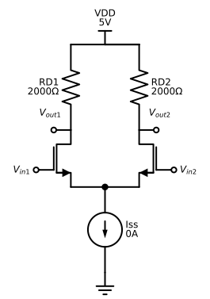
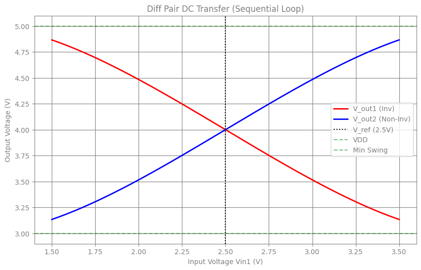

# MOS Differential Pair

## Introduction

In this section, we analyze the MOS Differential Pair, the fundamental input stage of operational amplifiers and logic gates. The circuit consists of two matched NMOS transistors ($M_1, M_2$) sharing a common "tail" current source ($I_{SS}$).We will perform a DC Transfer Analysis, sweeping the input voltage $V_{in1}$ from $1.5V$ to $3.5V$ while holding $V_{in2}$ constant at $2.5V$. This simulation reveals how the tail current steers between the two branches, creating the characteristic sigmoidal differential output.

Simulating a sweep in JAX requires a different mindset than standard Python loops:

* **Immutability**: JAX arrays and circuit objects are immutable. We cannot simply do circuit.R1.value = 10. Instead, we define a functional update_param_value helper that returns a new circuit definition with the modified parameter.

* **Sequential Continuation (jax.lax.scan)**: Unlike a Monte Carlo simulation where every run is independent (perfect for vmap), a DC sweep works best when sequential. By using `jax.lax.scan`, we feed the solution of the previous voltage step (y_prev) as the initial guess for the current step. This "homotopy" or continuation method drastically improves convergence stability for non-linear components like MOSFETs.

* **Compilation**: The entire sweep loop is compiled into a single XLA kernel, executing thousands of voltage steps in milliseconds.


```python
import time

import jax
import jax.numpy as jnp
import matplotlib.pyplot as plt

from circulax import compile_circuit, update_params_dict
from circulax.components.electronic import NMOS, CurrentSource, Resistor, VoltageSource

jax.config.update("jax_enable_x64", True)
```

    KLUJAX_RS DEBUG MODE.
    WARNING:2026-04-15 17:32:29,307:jax._src.xla_bridge:864: An NVIDIA GPU may be present on this machine, but a CUDA-enabled jaxlib is not installed. Falling back to cpu.


```python
net_dict = {
    "instances": {
        "GND": {"component": "ground"},
        "VDD": {"component": "source_dc", "settings": {"V": 5.0}},
        "Iss": {"component": "current_src", "settings": {"I": 1e-3}},
        "RD1": {"component": "resistor", "settings": {"R": 2000}},
        "RD2": {"component": "resistor", "settings": {"R": 2000}},
        "M1": {"component": "nmos", "settings": {"W": 50e-6, "L": 1e-6}},
        "M2": {"component": "nmos", "settings": {"W": 50e-6, "L": 1e-6}},
        "Vin1": {"component": "source_dc", "settings": {"V": 1.5}},
        "Vin2": {"component": "source_dc", "settings": {"V": 2.5}},
    },
    "connections": {
        "GND,p1": ("VDD,p2", "Vin1,p2", "Vin2,p2", "Iss,p2"),
        "Iss,p1": ("M1,s", "M2,s"),
        "M1,d": "RD1,p2",
        "M2,d": "RD2,p2",
        "RD1,p1": "VDD,p1",
        "RD2,p1": "VDD,p1",
        "Vin1,p1": "M1,g",
        "Vin2,p1": "M2,g",
    },
}
```





```python
models_map = {
    "nmos": NMOS,
    "resistor": Resistor,
    "source_dc": VoltageSource,
    "current_src": CurrentSource,
    "ground": lambda: 0,
}

print("1. Compiling...")
circuit = compile_circuit(net_dict, models_map)


@jax.jit
def scan_step(y_prev, v_in_val):
    new_groups = update_params_dict(circuit.groups, "source_dc", "Vin1", "V", v_in_val)
    y_sol = circuit.solver.solve_dc(new_groups, y_prev)
    return y_sol, y_sol


sweep_voltages = jnp.linspace(1.5, 3.5, 1000)

print(f"2. Running Sweep ({len(sweep_voltages)} points)...")
print("Sweeping DC Operating Point (with Continuation)...")
start_time = time.time()

y_current = jnp.zeros(circuit.sys_size)
# Using JAX scan, the previous solution is used as a guess for the sequential root solve
final_y, solutions = jax.lax.scan(scan_step, y_current, sweep_voltages)

total = time.time() - start_time
print(f"Simulation Time: {total:.3f}s")

v_out1 = circuit.get_port_field(solutions, "RD1,p2")
v_out2 = circuit.get_port_field(solutions, "RD2,p2")

plt.figure(figsize=(10, 6))
plt.plot(sweep_voltages, v_out1, "r-", linewidth=2, label="V_out1 (Inv)")
plt.plot(sweep_voltages, v_out2, "b-", linewidth=2, label="V_out2 (Non-Inv)")

plt.axvline(2.5, color="k", linestyle=":", label="V_ref (2.5V)")
plt.axhline(5.0, color="green", linestyle="--", alpha=0.5, label="VDD")
plt.axhline(5.0 - (1e-3 * 2000), color="green", linestyle="--", alpha=0.5, label="Min Swing")

plt.title("Diff Pair DC Transfer (Sequential Loop)")
plt.xlabel("Input Voltage Vin1 (V)")
plt.ylabel("Output Voltage (V)")
plt.legend()
plt.grid(True)
plt.show()
```

    1. Compiling...


    2. Running Sweep (1000 points)...
    Sweeping DC Operating Point (with Continuation)...


    Simulation Time: 0.351s





```python

```
