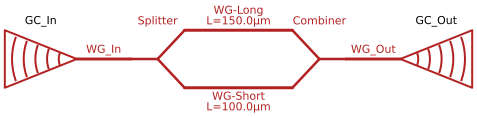

# Mach-Zehnder Inteferometer

## Introduciton

In this example, the vmap capabilities of the solver will be demonstrated to perform a wavelength sweep in the optical domain of an asummetric MZM coupled by two grating couplers. This is a very common structure in photonics.

## Key Modeling Concepts

* Waveguides as Transmission Lines: Unlike ideal electrical wires, optical waveguides have significant phase delay and propagation loss proportional to their length. Our Waveguide model captures this phase accumulation $\phi = \beta L$.

* S-Parameters: The "Splitter" is modeled as a 3-port device (1 Input, 2 Outputs) with a specific power splitting ratio (here 50:50).

* Grating Couplers: These components couple light from the chip surface to an optical fiber. They are highly frequency-dependent (bandpass filters).

In this netlist, they are terminated by "Loads" (Resistors), representing the matched impedance of a photodetector or optical power meter.


```python
import time

import jax
import jax.numpy as jnp
import matplotlib.pyplot as plt

from circulax import compile_circuit
from circulax.components.electronic import Resistor
from circulax.components.photonic import Grating, OpticalSource, OpticalWaveguide, Splitter
```

    KLUJAX_RS DEBUG MODE.
    WARNING:2026-04-15 17:32:29,265:jax._src.xla_bridge:864: An NVIDIA GPU may be present on this machine, but a CUDA-enabled jaxlib is not installed. Falling back to cpu.


```python
net_dict = {
    "instances": {
        "GND": {"component": "ground"},
        "Laser": {"component": "source", "settings": {"power": 1.0, "phase": 0.0}},
        # Input Coupling
        "GC_In": {
            "component": "grating",
            "settings": {"peak_loss_dB": 1.0, "bandwidth_1dB": 40.0},
        },
        "WG_In": {"component": "waveguide", "settings": {"length_um": 50.0}},
        # The Interferometer
        "Splitter": {"component": "splitter", "settings": {"split_ratio": 0.5}},
        "WG_Long": {
            "component": "waveguide",
            "settings": {"length_um": 150.0},
        },  # Delta L = 100um
        "WG_Short": {"component": "waveguide", "settings": {"length_um": 100.0}},
        "Combiner": {
            "component": "splitter",
            "settings": {"split_ratio": 0.5},
        },  # Reciprocal Splitter
        # Output Coupling
        "WG_Out": {"component": "waveguide", "settings": {"length_um": 50.0}},
        "GC_Out": {
            "component": "grating",
            "settings": {"peak_loss_dB": 1.0, "bandwidth_1dB": 40.0},
        },
        "Detector": {"component": "resistor", "settings": {"R": 1.0}},
    },
    "connections": {
        "GND,p1": ("Laser,p2", "Detector,p2"),
        # Input: Laser -> GC -> WG -> Splitter
        "Laser,p1": "GC_In,grating",
        "GC_In,waveguide": "WG_In,p1",
        "WG_In,p2": "Splitter,p1",
        # Arms
        "Splitter,p2": "WG_Long,p1",
        "Splitter,p3": "WG_Short,p1",
        "WG_Long,p2": "Combiner,p2",
        "WG_Short,p2": "Combiner,p3",
        # Output: Combiner -> WG -> GC -> Detector
        "Combiner,p1": "WG_Out,p1",
        "WG_Out,p2": "GC_Out,waveguide",
        "GC_Out,grating": "Detector,p1",
    },
}
```





```python
models_map = {
    "grating": Grating,
    "waveguide": OpticalWaveguide,
    "splitter": Splitter,
    "source": OpticalSource,
    "resistor": Resistor,
    "ground": lambda: 0,
}

print("--- DEMO: Photonic Splitter & Grating Link (Wavelength Sweep) ---")

circuit = compile_circuit(net_dict, models_map, is_complex=True)

wavelengths = jnp.linspace(1260, 1360, 2000)

print("Sweeping Wavelength...")
start = time.time()
solutions = jax.jit(circuit)(wavelength_nm=wavelengths)
total = time.time() - start
print(f"Sweep time: {total:.3f}s")

v_out1 = circuit.get_port_field(solutions, "Detector,p1")
p_out1_db = 10.0 * jnp.log10(jnp.abs(v_out1) ** 2 + 1e-12)

plt.figure(figsize=(8, 4))
plt.plot(wavelengths, p_out1_db, "b-", label="Port 1 (Split)")
plt.title("Grating and MZM Response")
plt.xlabel("Wavelength (nm)")
plt.ylabel("Received Power (dB)")
plt.legend()
plt.grid(True)
plt.show()
```

    --- DEMO: Photonic Splitter & Grating Link (Wavelength Sweep) ---


    Sweeping Wavelength...


    Sweep time: 1.345s


