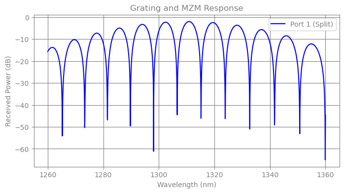

# Mach-Zehnder Inteferometer

## Introduciton

In this example, the vmap capabilities of the solver will be demonstrated to perform a wavelength sweep in the optical domain of an asummetric MZM coupled by two grating couplers. This is a very common structure in photonics.

## Key Modeling Concepts

* Waveguides as Transmission Lines: Unlike ideal electrical wires, optical waveguides have significant phase delay and propagation loss proportional to their length. Our Waveguide model captures this phase accumulation $\phi = \beta L$.

* S-Parameters: The "Splitter" is modeled as a 3-port device (1 Input, 2 Outputs) with a specific power splitting ratio (here 50:50).

* Grating Couplers: These components couple light from the chip surface to an optical fiber. They are highly frequency-dependent (bandpass filters).

In this netlist, they are terminated by "Loads" (Resistors), representing the matched impedance of a photodetector or optical power meter.


```python
import time

import jax
import jax.numpy as jnp
import matplotlib.pyplot as plt

from circulax.compiler import compile_netlist
from circulax.solvers import analyze_circuit
from circulax.utils import update_group_params

```

    KLUJAX_RS DEBUG MODE.


```python
net_dict = {
    "instances": {
        "GND": {"component": "ground"},
        "Laser": {"component": "source", "settings": {"power": 1.0, "phase": 0.0}},
        # Input Coupling
        "GC_In": {
            "component": "grating",
            "settings": {"peak_loss_dB": 1.0, "bandwidth_1dB": 40.0},
        },
        "WG_In": {"component": "waveguide", "settings": {"length_um": 50.0}},
        # The Interferometer
        "Splitter": {"component": "splitter", "settings": {"split_ratio": 0.5}},
        "WG_Long": {
            "component": "waveguide",
            "settings": {"length_um": 150.0},
        },  # Delta L = 100um
        "WG_Short": {"component": "waveguide", "settings": {"length_um": 100.0}},
        "Combiner": {
            "component": "splitter",
            "settings": {"split_ratio": 0.5},
        },  # Reciprocal Splitter
        # Output Coupling
        "WG_Out": {"component": "waveguide", "settings": {"length_um": 50.0}},
        "GC_Out": {
            "component": "grating",
            "settings": {"peak_loss_dB": 1.0, "bandwidth_1dB": 40.0},
        },
        "Detector": {"component": "resistor", "settings": {"R": 1.0}},
    },
    "connections": {
        "GND,p1": ("Laser,p2", "Detector,p2"),
        # Input: Laser -> GC -> WG -> Splitter
        "Laser,p1": "GC_In,grating",
        "GC_In,waveguide": "WG_In,p1",
        "WG_In,p2": "Splitter,p1",
        # Arms
        "Splitter,p2": "WG_Long,p1",
        "Splitter,p3": "WG_Short,p1",
        "WG_Long,p2": "Combiner,p2",
        "WG_Short,p2": "Combiner,p3",
        # Output: Combiner -> WG -> GC -> Detector
        "Combiner,p1": "WG_Out,p1",
        "WG_Out,p2": "GC_Out,waveguide",
        "GC_Out,grating": "Detector,p1",
    },
}
```


```python
from circulax.components.electronic import Resistor
from circulax.components.photonic import (
    Grating,
    OpticalSource,
    OpticalWaveguide,
    Splitter,
)

print("--- DEMO: Photonic Splitter & Grating Link (Wavelength Sweep) ---")

models_map = {
    "grating": Grating,
    "waveguide": OpticalWaveguide,
    "splitter": Splitter,
    "source": OpticalSource,
    "resistor": Resistor,
    "ground": lambda: 0,
}


groups, sys_size, port_map = compile_netlist(net_dict, models_map)

wavelengths = jnp.linspace(1260, 1360, 2000)

solver_strat = analyze_circuit(groups, sys_size, is_complex=True)

print("Sweeping Wavelength...")


@jax.jit
def solve_for_loss(val):
    g = update_group_params(groups, "grating", "wavelength_nm", val)
    g = update_group_params(g, "waveguide", "wavelength_nm", val)
    y_flat = solver_strat.solve_dc(g, y_guess=jnp.ones(sys_size * 2))
    return y_flat


start = time.time()
print("Solving for single wavelength (and jit compiling)")
solve_for_loss(1310)
total = time.time() - start
print(f"Compilation and single point simulation Time: {total:.3f}s")

print("Sweeping DC Operating Point...")
start = time.time()
solutions = jax.vmap(solve_for_loss)(wavelengths)
total = time.time() - start
print(f"Vmap simulation Time: {total:.3f}s")

v_out1 = (
    solutions[:, port_map["Detector,p1"]]
    + 1j * solutions[:, port_map["Detector,p1"] + sys_size]
)
# v_out2 = solutions[:, port_map["Load2,p1" ]] + 1j * solutions[:, port_map["Load2,p1"]+sys_size]

p_out1_db = 10.0 * jnp.log10(jnp.abs(v_out1) ** 2 + 1e-12)
# p_out2_db = 10.0 * jnp.log10(jnp.abs(v_out2)**2 + 1e-12)

plt.figure(figsize=(8, 4))
plt.plot(wavelengths, p_out1_db, "b-", label="Port 1 (Split)")
# plt.plot(wavelengths, p_out2_db, 'r--', label='Port 2 (Split)')

plt.title("Grating and MZM Response")
plt.xlabel("Wavelength (nm)")
plt.ylabel("Received Power (dB)")
plt.legend()
plt.grid(True)
plt.show()
```

    --- DEMO: Photonic Splitter & Grating Link (Wavelength Sweep) ---


    Sweeping Wavelength...
    Solving for single wavelength (and jit compiling)


    Compilation and single point simulation Time: 0.854s
    Sweeping DC Operating Point...


    Vmap simulation Time: 1.339s



