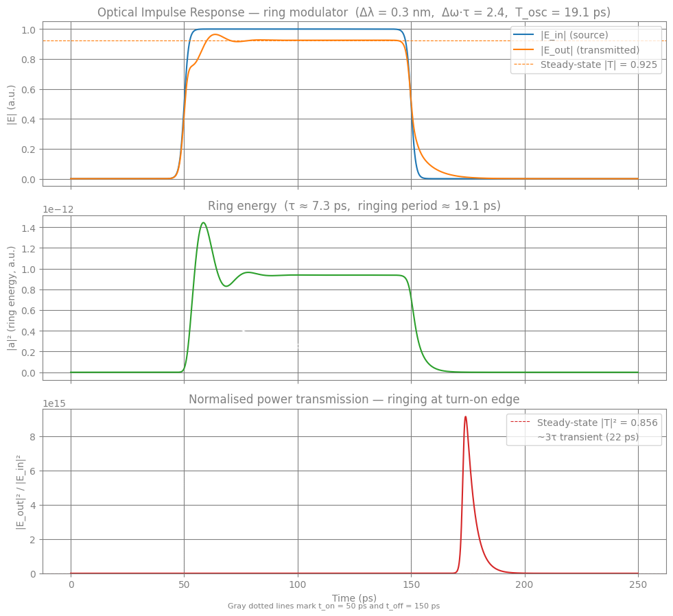
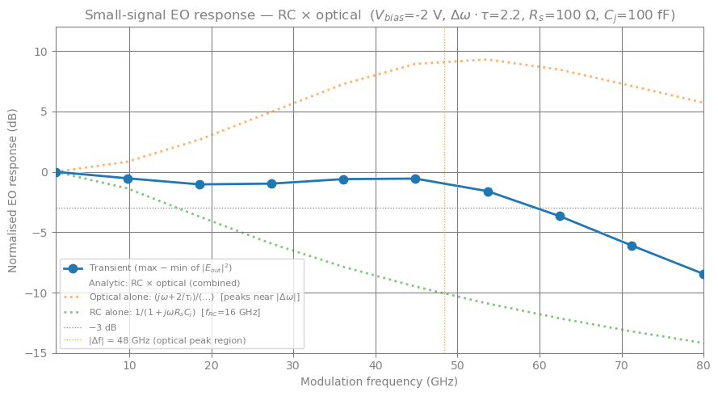
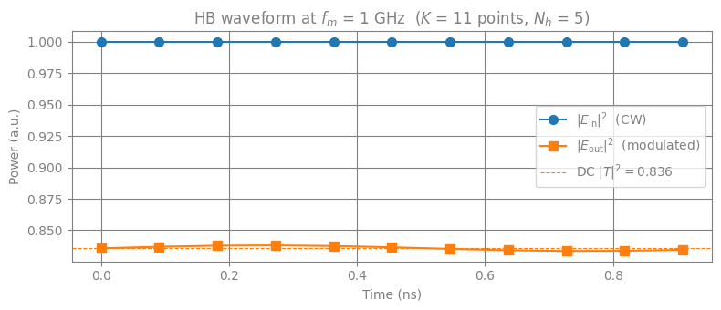
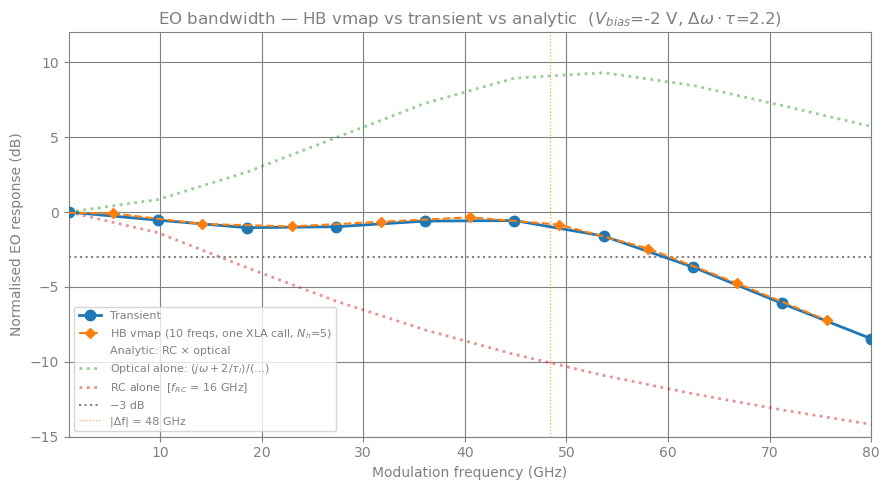
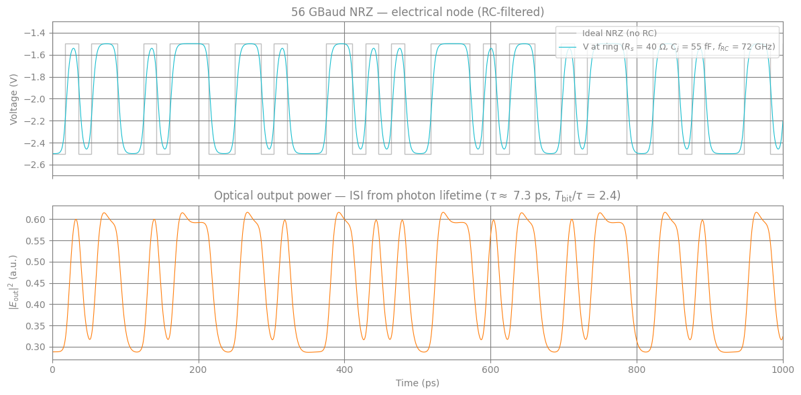
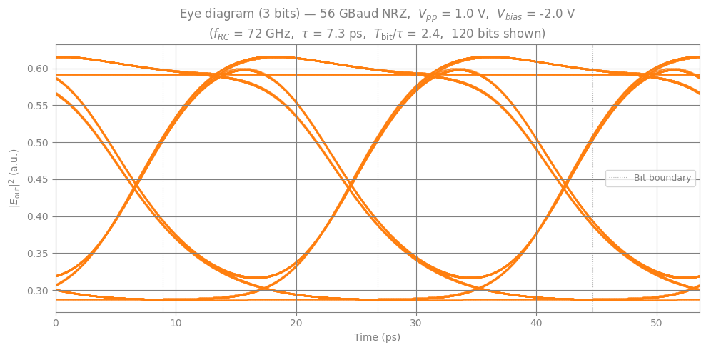
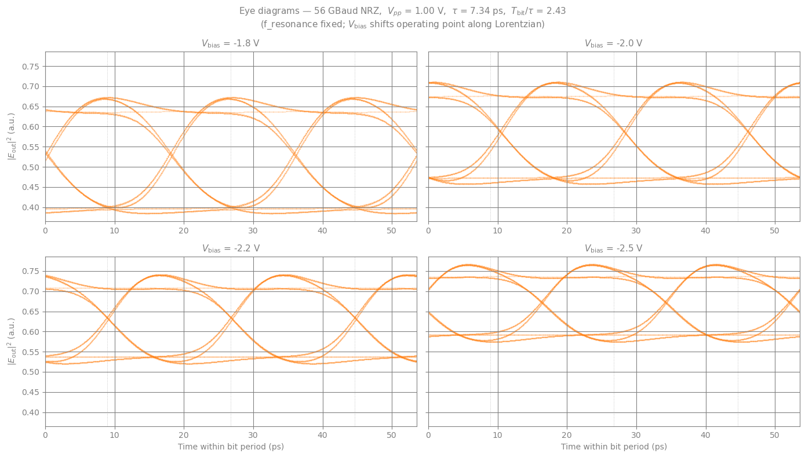

# Silicon Ring Modulator: Electro-Optic Simulation

This notebook simulates the transient optical response of a ring resonator
modulator using **Temporal Coupled-Mode Theory (t-CMT)**. An optical pulse is
launched into a bus waveguide coupled to the ring. We observe how the ring
energy $a(t)$ builds up and decays, and how this shapes the transmitted field.

This notebook covers four progressively more complex analyses:

- **Part 1 Optical impulse response**: Step-on/off pulse excites the ring, revealing the photon lifetime $\tau$.
- **Part 2 Small-signal EO bandwidth (time-domain sweep)**: AC voltage drives a PN junction; transient simulation extracts the EO 3-dB bandwidth.
- **Part 3 EO bandwidth via Harmonic Balance**: Same bandwidth measurement using `jax.vmap` over frequency in a single JIT call.
- **Part 4 Large-signal NRZ eye diagram**: 128-bit PRBS pattern at 56 GBaud reveals ISI from photon-lifetime memory.
- **Part 5 $V_\mathrm{bias}$ sweep via `jax.vmap`**: Four eye diagrams at different bias voltages, computed in a single vmapped transient call.

## t-CMT equations

The complex ring energy $a(t)$ (with $|a|^2$ in units of energy) evolves as:

$$\frac{da}{dt} = -j\sqrt{\frac{2}{\tau_e}}\,E_i(t)
   + j\,\Delta\omega\,a(t)
   - \frac{a(t)}{\tau}$$

where $\Delta\omega = 2\pi(f_{\rm op} - f_r) + V_{\rm wr}\,V$ is the
laser\u2013resonance detuning, and $1/\tau = 1/\tau_e + 1/\tau_l$ combines the
coupling ($\tau_e$) and loss ($\tau_l$) photon lifetimes. The transmitted
field is

$$E_o(t) = E_i(t) - j\sqrt{\frac{2}{\tau_e}}\,a(t).$$

## Mapping to the circulax DAE ($F + dQ/dt = 0$)

The `RingModulator` component below carries two internal states:

| State | $F$-term (residual) | $Q$-term (storage) | Role |
|-------|---------------------|---------------------|------|
| `a`   | $j\sqrt{2/\tau_e}\,V_{p1} - j\Delta\omega\,a + a/\tau$ | $a$ | Ring energy ODE |
| `i_out` | $V_{p2}-(V_{p1}-j\sqrt{2/\tau_e}\,a)$ | -- | Output field constraint |

Port `p1` (input) contributes zero current \u2014 the ring is transparent at the
input (S11 = 0), so the source drives the input field directly. Port `p2`
(output) is driven by the auxiliary state `i_out`, which enforces the output
field relation algebraically.

The ring energy can be recovered as a post-processing step directly from the
port voltages: $a = -j\,(E_i - E_o)/\sqrt{2/\tau_e}$.

---
*References: [Absil et al., OE 2000](http://photonics.intec.ugent.be/download/pub_2992.pdf);
[Choi et al., OE 2015](https://opg.optica.org/DirectPDFAccess/D179E5F2-51D2-4CA2-AB8938DF5E6472DF_314277/oe-23-7-8762.pdf)*


```python
import diffrax
import jax
import jax.numpy as jnp
import matplotlib.pyplot as plt
import numpy as np

from circulax import compile_circuit
from circulax.components.base_component import PhysicsReturn, Signals, States, component, source
from circulax.components.electronic import Resistor
from circulax.solvers import setup_transient

jax.config.update("jax_enable_x64", True)
```

    KLUJAX_RS DEBUG MODE.
    WARNING:2026-04-15 17:32:29,274:jax._src.xla_bridge:864: An NVIDIA GPU may be present on this machine, but a CUDA-enabled jaxlib is not installed. Falling back to cpu.


## Component definitions


```python
@source(ports=("p1", "p2"), states=("i_src",))
def OpticalSourcePulseOnOff(
    signals: Signals,
    s: States,
    t: float,
    power: float = 1.0,
    phase: float = 0.0,
    t_on: float = 50e-12,
    t_off: float = 150e-12,
    rise: float = 5e-12,
) -> PhysicsReturn:
    """CW optical source with a smooth rectangular pulse envelope.

    Two sigmoid ramps (one up, one down) define the on/off transitions.
    The rise-time constant ``rise`` should be chosen small relative to the
    photon lifetime to approximate a sharp turn-on/off.

    Args:
        signals: Field amplitudes at positive (``p1``) and negative (``p2``) ports.
        s: Source current state variable ``i_src``.
        t: Simulation time.
        power: Peak optical power in watts. Defaults to ``1.0``.
        phase: Output field phase in radians. Defaults to ``0.0``.
        t_on: Turn-on time in seconds. Defaults to ``50e-12``.
        t_off: Turn-off time in seconds. Defaults to ``150e-12``.
        rise: Sigmoid rise/fall time constant. Defaults to ``5e-12``.

    """
    sigmoid_on = jax.nn.sigmoid((t - t_on) / rise)
    sigmoid_off = jax.nn.sigmoid((t - t_off) / rise)
    amp = jnp.sqrt(power) * jnp.exp(1j * phase) * (sigmoid_on - sigmoid_off)
    constraint = (signals.p1 - signals.p2) - amp
    return {"p1": s.i_src, "p2": -s.i_src, "i_src": constraint}, {}


@component(ports=("p1", "p2"), states=("a", "i_out"))
def RingModulator(
    signals: Signals,
    s: States,
    ng: float = 3.8,
    L: float = 3.14159265e-5,
    gamma: float = 0.976,
    alpha0: float = 0.969,
    alpha1: float = 0.0,
    voltage: float = 0.0,
    f_operating: float = 2.2904e14,
    f_resonance: float = 2.2901e14,
    v_to_wr: float = 0.0,
) -> PhysicsReturn:
    """Optical ring modulator via Temporal Coupled-Mode Theory (t-CMT).

    Tracks the complex ring energy amplitude ``a(t)`` as an internal state and
    enforces the output field relation ``E_o = E_i - j sqrt(2/tau_e) a`` via an
    algebraic constraint state ``i_out``.

    The ring energy ODE is expressed in the circulax DAE form F + dQ/dt = 0:

    - F["a"] = -(da/dt RHS) = j sqrt(2/tau_e) V_p1 - j Delta_omega a + a/tau
    - Q["a"] = a

    Gives: da/dt = -j sqrt(2/tau_e) E_i + j Delta_omega a - a/tau.

    Port ``p1`` contributes zero current (S11 = 0 approximation).
    Port ``p2`` is driven by ``i_out`` which enforces the output field.

    Args:
        signals: Complex field amplitudes at input (``p1``) and output (``p2``).
        s: Internal states: ``a`` (complex ring energy) and ``i_out`` (output
            constraint current).
        ng: Group refractive index. Defaults to ``3.8``.
        L: Ring circumference in metres. Defaults to ``2*pi*5e-6``.
        gamma: Through-coupling amplitude coefficient. Defaults to ``0.976``.
        alpha0: Voltage-independent round-trip amplitude. Defaults to ``0.969``.
        alpha1: Linear voltage coefficient of round-trip amplitude (1/V).
            Defaults to ``0.0``.
        voltage: Applied DC bias voltage. Defaults to ``0.0``.
        f_operating: Laser frequency in Hz. Defaults to ``2.2904e14``.
        f_resonance: Ring resonance frequency in Hz. Defaults to ``2.2901e14``.
        v_to_wr: Electro-optic coefficient mapping voltage to resonance shift
            in rad/s/V. Defaults to ``0.0``.

    """
    c = 2.998e8  # speed of light, m/s

    # Photon lifetimes
    tau_e = 2.0 * ng * L / ((1.0 - gamma**2) * c)
    alpha_v = alpha0 + alpha1 * voltage
    tau_l = 2.0 * ng * L / ((1.0 - alpha_v**2) * c)
    tau = 1.0 / (1.0 / tau_e + 1.0 / tau_l)

    coupling = jnp.sqrt(2.0 / tau_e)

    # Laser-resonance detuning (+ EO shift)
    delta_omega = 2.0 * jnp.pi * (f_operating - f_resonance) + v_to_wr * voltage

    # Ring energy ODE RHS: da/dt = -j*coupling*E_i + j*delta_omega*a - a/tau
    rhs_a = -1j * coupling * signals.p1 + 1j * delta_omega * s.a - s.a / tau

    # Output field from the ring: E_o = E_i - j*coupling*a
    E_o_expected = signals.p1 - 1j * coupling * s.a

    f = {
        "p1": 0.0 + 0.0j,  # ring is transparent at input (S11=0)
        "p2": s.i_out,
        "i_out": signals.p2 - E_o_expected,  # enforce E_o = E_i - j*coupling*a
        "a": -rhs_a,  # ring energy ODE (negated RHS)
    }
    q = {"a": s.a}
    return f, q
```

## Simulation parameters

Parameters are taken from the reference silicon photonics ring modulator
in [Choi et al., OE 2015](https://opg.optica.org/DirectPDFAccess/D179E5F2-51D2-4CA2-AB8938DF5E6472DF_314277/oe-23-7-8762.pdf).


```python
c = 2.998e8  # m/s

# Ring geometry and coupling
ng = 3.8
radius_um = 5.0  # ring radius, μm
L_ring = float(2.0 * np.pi * radius_um * 1e-6)  # circumference, m
gamma = 0.976  # through-coupling amplitude
alpha0 = 0.969  # round-trip amplitude (unbiased)

# Operating wavelength – 0.30 nm blue-detuned from resonance.
# This gives Δω·τ ≈ 2.4, producing ~1–2 visible ringing cycles during the
# ~3τ transient when the source turns on with a sharp (1 ps) rise time.
wavelength_res_nm = 1310.0
detuning_nm = 0.30
wavelength_op_nm = wavelength_res_nm - detuning_nm

f_resonance = c / (wavelength_res_nm * 1e-9)
f_operating = c / (wavelength_op_nm * 1e-9)

# Derived photon lifetimes
tau_e = 2.0 * ng * L_ring / ((1.0 - gamma**2) * c)
tau_l = 2.0 * ng * L_ring / ((1.0 - alpha0**2) * c)
tau = 1.0 / (1.0 / tau_e + 1.0 / tau_l)
coupling = np.sqrt(2.0 / tau_e)

# Ringing oscillation period: beats between laser and ring resonance
delta_f = f_operating - f_resonance
T_osc = 1.0 / delta_f  # period of output power oscillation during transient

# Steady-state transmission (analytic)
A = 2.0 * tau / tau_e
x = 2.0 * np.pi * delta_f * tau  # normalised detuning Δω·τ
T_ss = np.sqrt(((1 - A) ** 2 + x**2) / (1 + x**2))

print(f"Ring circumference : L = {L_ring * 1e6:.2f} μm  (R = {radius_um} μm)")
print(f"Coupling lifetime  : τ_e = {tau_e * 1e12:.1f} ps")
print(f"Loss lifetime      : τ_l = {tau_l * 1e12:.1f} ps")
print(f"Photon lifetime    : τ   = {tau * 1e12:.2f} ps")
print(f"Laser detuning     : Δf  = {delta_f / 1e9:.1f} GHz  ({detuning_nm} nm)  →  Δω·τ = {x:.2f}")
print(f"Ringing period     : T_osc = {T_osc * 1e12:.1f} ps  (~{3 * tau / T_osc:.1f} cycles during rise)")
print(f"Steady-state |T|   : {T_ss:.3f}  ({20 * np.log10(T_ss):.1f} dB)")
```

    Ring circumference : L = 31.42 μm  (R = 5.0 μm)
    Coupling lifetime  : τ_e = 16.8 ps
    Loss lifetime      : τ_l = 13.0 ps
    Photon lifetime    : τ   = 7.34 ps
    Laser detuning     : Δf  = 52.4 GHz  (0.3 nm)  →  Δω·τ = 2.42
    Ringing period     : T_osc = 19.1 ps  (~1.2 cycles during rise)
    Steady-state |T|   : 0.925  (-0.7 dB)


## Netlist and compilation


```python
rise_time = 1e-12  # 1 ps rise/fall — sharp enough to excite ring ringing clearly

models_map = {
    "ground": lambda: 0,
    "source_pulse_onoff": OpticalSourcePulseOnOff,
    "ring_modulator": RingModulator,
    "resistor": Resistor,
}

net_dict = {
    "instances": {
        "GND": {"component": "ground"},
        "Src": {
            "component": "source_pulse_onoff",
            "settings": {
                "power": 1.0,
                "t_on": 50e-12,
                "t_off": 150e-12,
                "rise": rise_time,
            },
        },
        "Ring": {
            "component": "ring_modulator",
            "settings": {
                "ng": ng,
                "L": L_ring,
                "gamma": gamma,
                "alpha0": alpha0,
                "f_operating": float(f_operating),
                "f_resonance": float(f_resonance),
            },
        },
        "Load": {"component": "resistor", "settings": {"R": 1.0}},
    },
    "connections": {
        "GND,p1": ("Src,p2", "Load,p2"),  # common ground
        "Src,p1": "Ring,p1",  # source output → ring input
        "Ring,p2": "Load,p1",  # ring output → load
    },
}

print("Compiling netlist...")
circuit = compile_circuit(net_dict, models_map, is_complex=True)
groups = circuit.groups
sys_size = circuit.sys_size
port_map = circuit.port_map
```

    Compiling netlist...


## DC operating point

At $t = 0$ the source is off, so the DC operating point is trivially zero.


```python
linear_strat = circuit.solver
y0 = circuit()
```

## Transient simulation

The simulation runs for 250 ps, long enough to see both the ring energy
buildup ($\sim 3\tau \approx 22\,\text{ps}$ to reach 95\%) and the decay
after the optical pulse is switched off.

### Convergence note: `dtmax` in the step-size controller

With a 1 ps rise time, the adaptive PID step-size controller will eventually
grow the step to $\gg 1\,\text{ps}$. When a single step spans the entire
transition, the linear predictor lands far from the true solution, the Newton
residual becomes large, and the built-in damping (`DAMPING_FACTOR = 0.5`)
shrinks each Newton update to $\lesssim 0.5 / \Delta_{\rm max}$.

The fix is **`dtmax = rise_time / 2`** in `PIDController`, which prevents any
single step from spanning the source transition. This keeps the predictor
accurate and Newton convergence fast.


```python
t_end = 250e-12  # 250 ps
num_points = 2500

transient_sim = setup_transient(groups=groups, linear_strategy=linear_strat)

controller = diffrax.PIDController(
    rtol=1e-4,
    atol=1e-6,
    dtmax=rise_time / 2,  # keep steps within the source rise time
)

print("Running transient simulation...")
sol = transient_sim(
    t0=0.0,
    t1=t_end,
    dt0=1e-13,
    y0=y0,
    saveat=diffrax.SaveAt(ts=jnp.linspace(0.0, t_end, num_points)),
    max_steps=500000,
    throw=False,
    stepsize_controller=controller,
)

if sol.result == diffrax.RESULTS.successful:
    print("Simulation successful")
else:
    print(f"Simulation ended with: {sol.result}")
```

    Running transient simulation...


    Simulation successful


## Results

The ring energy $a(t)$ is read directly from the solution vector via
`port_map["Ring,a"]`, alongside the input and output fields.


```python
ts_ps = sol.ts * 1e12

E_in = circuit.get_port_field(sol.ys, "Src,p1")
E_out = circuit.get_port_field(sol.ys, "Ring,p2")
a_val = circuit.get_port_field(sol.ys, "Ring,a")

P_in = jnp.abs(E_in) ** 2
P_out = jnp.abs(E_out) ** 2
eps = 1e-20

fig, axes = plt.subplots(3, 1, figsize=(10, 9), sharex=True)

t_on_ps = 50.0
T_osc_ps = T_osc * 1e12

axes[0].plot(ts_ps, jnp.abs(E_in), color="tab:blue", linewidth=1.5, label="|E_in| (source)")
axes[0].plot(ts_ps, jnp.abs(E_out), color="tab:orange", linewidth=1.5, label="|E_out| (transmitted)")
axes[0].axhline(T_ss, color="tab:orange", linestyle="--", linewidth=0.8, label=f"Steady-state |T| = {T_ss:.3f}")
axes[0].set_ylabel("|E| (a.u.)")
axes[0].set_title(
    f"Optical Impulse Response — ring modulator  (Δλ = {detuning_nm} nm,  Δω·τ = {x:.1f},  T_osc = {T_osc_ps:.1f} ps)"
)
axes[0].legend(loc="upper right")

axes[1].plot(ts_ps, jnp.abs(a_val) ** 2, color="tab:green", linewidth=1.5)
axes[1].set_ylabel("|a|² (ring energy, a.u.)")
axes[1].set_title(f"Ring energy  (τ ≈ {tau * 1e12:.1f} ps,  ringing period ≈ {T_osc_ps:.1f} ps)")

a2_ss = (2.0 / tau_e) * tau**2 / (1 + x**2)
axes[1].annotate(
    f"T_osc ≈ {T_osc_ps:.0f} ps",
    xy=(t_on_ps + T_osc_ps, a2_ss * 0.5),
    xytext=(t_on_ps + T_osc_ps + 8, a2_ss * 0.25),
    arrowprops=dict(arrowstyle="->", color="white"),
    color="white",
    fontsize=9,
)

P_out_norm = P_out / (P_in + eps)
axes[2].plot(ts_ps, P_out_norm, color="tab:red", linewidth=1.5)
axes[2].axhline(T_ss**2, color="tab:red", linestyle="--", linewidth=0.8, label=f"Steady-state |T|² = {T_ss**2:.3f}")
axes[2].axvspan(t_on_ps, t_on_ps + 3 * tau * 1e12, alpha=0.08, color="white", label=f"~3τ transient ({3 * tau * 1e12:.0f} ps)")
axes[2].set_ylabel("|E_out|² / |E_in|²")
axes[2].set_xlabel("Time (ps)")
axes[2].set_title("Normalised power transmission — ringing at turn-on edge")
axes[2].legend(loc="upper right")
axes[2].set_ylim(bottom=0)

for ax in axes:
    ax.axvline(50, color="gray", linestyle=":", linewidth=0.8, alpha=0.6)
    ax.axvline(150, color="gray", linestyle=":", linewidth=0.8, alpha=0.6)

fig.text(0.5, 0.01, "Gray dotted lines mark t_on = 50 ps and t_off = 150 ps", ha="center", color="gray", fontsize=8)

fig.tight_layout()
plt.show()

mid = num_points // 2
print(f"Simulated steady-state |T|: {float(jnp.abs(E_out[mid]) / (jnp.abs(E_in[mid]) + eps)):.3f}")
print(f"Analytic  steady-state |T|: {T_ss:.3f}")
```





    Simulated steady-state |T|: 0.925
    Analytic  steady-state |T|: 0.925


## Small-signal electro-optic bandwidth

> **Note — time-domain is overkill here.**
> A proper small-signal AC analysis or a Harmonic Balance (HB) solver would
> extract the EO frequency response in a single solve at each frequency, without
> integrating through many AC periods.  circulax already has a Harmonic Balance
> solver and small-signal AC analysis is a planned feature.
> The purpose of this section is to verify that the **time-domain DAE equations
> are equivalent** to the analytic transfer function — i.e. the equations are
> correct — not to advocate transient simulation as the right tool for bandwidth
> characterisation in production.

A small sinusoidal voltage is applied to the ring modulator through an RC
equivalent circuit that models a reverse-biased PN junction:

- **R_s** — series resistance (contact + waveguide)
- **C_j** — depletion capacitance (junction)

The combined small-signal EO response is limited by two first-order poles:

$$|H(f)| \propto \frac{1}{\sqrt{1 + (f/f_{\rm RC})^2}\;\sqrt{1 + (f/f_{\rm opt})^2}}$$

where $f_{\rm RC} = 1/(2\pi R_s C_j)$ and $f_{\rm opt} = 1/(2\pi\tau)$.

**Simulation strategy**: the DC operating point (optical CW + DC bias $V_{\rm bias}$)
is found first and used as the initial condition at $t = 0$.  A small AC swing
$V_{\rm ac}\sin(2\pi f t)$ is then enabled at $t = 10\,\text{ps}$.
For each modulation frequency the output power amplitude (max $-$ min of $|E_{\rm out}|^2$)
is extracted from the last half of the simulation and normalised to the
low-frequency value.


```python
from circulax.components.electronic import Capacitor
from circulax.utils import update_group_params


@source(ports=("p1", "p2"), states=("i_src",))
def OpticalSourceStep(
    signals: Signals,
    s: States,
    t: float,
    power: float = 1.0,
    phase: float = 0.0,
) -> PhysicsReturn:
    """Constant-amplitude optical CW source (always on, no time dependence)."""
    amp = jnp.sqrt(power) * jnp.exp(1j * phase)
    constraint = (signals.p1 - signals.p2) - amp
    return {"p1": s.i_src, "p2": -s.i_src, "i_src": constraint}, {}


@source(ports=("p1", "p2"), states=("i_src",))
def BiasedACSource(
    signals: Signals,
    s: States,
    t: float,
    V_bias: float = -2.0,
    V_ac: float = 0.1,
    freq: float = 1e9,
    t_ac_start: float = 10e-12,
    rise_ac: float = 1e-12,
) -> PhysicsReturn:
    """DC-biased sinusoidal voltage source.

    Outputs V_bias (always present) plus V_ac * sin(2π * freq * t), with the
    AC component enabled smoothly at t_ac_start.  At t=0 the AC term is
    negligibly small (sigmoid(-10) ≈ 0), so solve_dc finds the correct DC
    operating point with only V_bias present.
    """
    v_ac = V_ac * jnp.sin(2.0 * jnp.pi * freq * t)
    ac_enable = jax.nn.sigmoid((t - t_ac_start) / rise_ac)
    v_total = V_bias + v_ac * ac_enable
    constraint = (signals.p1 - signals.p2) - v_total
    return {"p1": s.i_src, "p2": -s.i_src, "i_src": constraint}, {}


@component(ports=("p1", "p2", "v_e"), states=("a", "i_out"))
def RingModulatorEO(
    signals: Signals,
    s: States,
    ng: float = 3.8,
    L: float = 3.14159265e-5,
    gamma: float = 0.976,
    alpha0: float = 0.969,
    alpha1: float = 0.0,
    f_operating: float = 2.2904e14,
    f_resonance: float = 2.2901e14,
    v_to_wr: float = 0.0,
) -> PhysicsReturn:
    """Ring modulator with an external electrical voltage port ``v_e``.

    The voltage at port ``v_e`` modulates the ring resonance frequency via
    ``v_to_wr`` (rad/s/V).  The port is high-impedance: it draws no current
    (``F["v_e"] = 0``), so any driver circuit sees an open circuit.

    The physics is otherwise identical to :func:`RingModulator`, but ``voltage``
    is read from the external port rather than being a fixed parameter.
    """
    c = 2.998e8
    voltage = jnp.real(signals.v_e)  # electrical port — real part only

    tau_e = 2.0 * ng * L / ((1.0 - gamma**2) * c)
    alpha_v = alpha0 + alpha1 * voltage
    tau_l = 2.0 * ng * L / ((1.0 - alpha_v**2) * c)
    tau = 1.0 / (1.0 / tau_e + 1.0 / tau_l)
    coupling = jnp.sqrt(2.0 / tau_e)

    delta_omega = 2.0 * jnp.pi * (f_operating - f_resonance) + v_to_wr * voltage

    rhs_a = -1j * coupling * signals.p1 + 1j * delta_omega * s.a - s.a / tau
    E_o_expected = signals.p1 - 1j * coupling * s.a

    f = {
        "p1": 0.0 + 0.0j,
        "p2": s.i_out,
        "v_e": 0.0 + 0.0j,  # high-impedance electrical port
        "i_out": signals.p2 - E_o_expected,
        "a": -rhs_a,
    }
    q = {"a": s.a}
    return f, q
```


```python
# ── Electrical RC parameters ──────────────────────────────────────────────
V_bias = -2.0  # V   — DC reverse bias (negative = reverse-biased PN junction)
V_ac = 0.2  # V   — small-signal swing (<<1, so response is linear)
R_s = 100.0  # Ω   — series resistance (contact + waveguide)
C_j = 100e-15  # F   — junction depletion capacitance
v_to_wr = 2.0 * np.pi * 2e9  # rad/s/V — EO coefficient (2 GHz/V resonance shift)
t_ac_start = 10e-12  # s   — delay before AC is enabled

f_RC = 1.0 / (2.0 * np.pi * R_s * C_j)  # electrical 3-dB bandwidth
f_opt_bw = 1.0 / (2.0 * np.pi * tau)  # optical photon-lifetime bandwidth

print(f"Electrical RC bandwidth : f_RC  = {f_RC / 1e9:.1f} GHz")
print(f"Optical photon-lifetime : f_opt = {f_opt_bw / 1e9:.1f} GHz")
print(f"EO coefficient          : dω/dV = {v_to_wr / (2e9 * np.pi):.1f} × 2π GHz/V")

# ── Models map ────────────────────────────────────────────────────────
models_map_ss = {
    "ground": lambda: 0,
    "optical_cw": OpticalSourceStep,
    "biased_ac": BiasedACSource,
    "ring_eo": RingModulatorEO,
    "resistor": Resistor,
    "capacitor": Capacitor,
}

# ── Netlist ───────────────────────────────────────────────────────────────────
# Topology:
#   OptSrc → Ring (optical path)
#   Vsrc → Rs → node_ve → Cj → GND  (electrical RC network)
#   Ring,v_e = node_ve  (high-impedance; ring reads voltage, draws no current)
net_dict_ss = {
    "instances": {
        "GND": {"component": "ground"},
        "OptSrc": {"component": "optical_cw", "settings": {"power": 1.0}},
        "Ring": {
            "component": "ring_eo",
            "settings": {
                "ng": ng,
                "L": L_ring,
                "gamma": gamma,
                "alpha0": alpha0,
                "f_operating": float(f_operating),
                "f_resonance": float(f_resonance),
                "v_to_wr": v_to_wr,
            },
        },
        "Load": {"component": "resistor", "settings": {"R": 1.0}},
        "Vsrc": {
            "component": "biased_ac",
            "settings": {
                "V_bias": V_bias,
                "V_ac": V_ac,
                "freq": 1e9,
                "t_ac_start": t_ac_start,
            },
        },
        "Rs": {"component": "resistor", "settings": {"R": R_s}},
        "Cj": {"component": "capacitor", "settings": {"C": C_j}},
    },
    "connections": {
        "GND,p1": ("OptSrc,p2", "Load,p2", "Vsrc,p2", "Cj,p2"),
        "OptSrc,p1": "Ring,p1",
        "Ring,p2": "Load,p1",
        "Vsrc,p1": "Rs,p1",
        "Rs,p2": ("Cj,p1", "Ring,v_e"),  # node_ve: RC junction & ring voltage port
    },
}

print("\nCompiling small-signal netlist...")
circuit_ss = compile_circuit(net_dict_ss, models_map_ss, is_complex=True)
groups_ss = circuit_ss.groups
sys_size_ss = circuit_ss.sys_size
port_map_ss = circuit_ss.port_map
linear_strat_ss = circuit_ss.solver
y0_ss = circuit_ss()

# Report DC state
V_ve_dc = float(jnp.real(circuit_ss.get_port_field(y0_ss, "Ring,v_e")))
E_in_dc = circuit_ss.get_port_field(y0_ss, "Ring,p1")
E_out_dc = circuit_ss.get_port_field(y0_ss, "Ring,p2")
T_dc_sim = float(jnp.abs(E_out_dc) / (jnp.abs(E_in_dc) + 1e-20))

# Analytic DC transmission at the biased detuning
delta_omega_dc = 2.0 * np.pi * (f_operating - f_resonance) + v_to_wr * V_bias
x_dc = delta_omega_dc * tau
A_dc = 2.0 * tau / tau_e
T_dc_analytic = np.sqrt(((1 - A_dc) ** 2 + x_dc**2) / (1 + x_dc**2))

print(f"\nDC node_ve voltage : {V_ve_dc:.3f} V  (expected {V_bias:.1f} V)")
print(f"DC |T| simulated   : {T_dc_sim:.4f}")
print(f"DC |T| analytic    : {T_dc_analytic:.4f}")
print(f"DC Δω·τ            : {x_dc:.3f}")
```

    Electrical RC bandwidth : f_RC  = 15.9 GHz
    Optical photon-lifetime : f_opt = 21.7 GHz
    EO coefficient          : dω/dV = 2.0 × 2π GHz/V

    Compiling small-signal netlist...


    DC node_ve voltage : -2.000 V  (expected -2.0 V)
    DC |T| simulated   : 0.9142
    DC |T| analytic    : 0.9142
    DC Δω·τ            : 2.234


```python
freqs_GHz = np.linspace(1.0, 80, 10)
N_periods = 10.0  # simulate this many AC periods per run
n_save = 500  # save this many points in the readout window
amplitudes = []  # will hold max(P_out) - min(P_out) per frequency

transient_sim_ss = setup_transient(groups=groups_ss, linear_strategy=linear_strat_ss)
E_out_node = port_map_ss["Ring,p2"]

print(f"Running {len(freqs_GHz)}-point frequency sweep …")
for idx, f_ghz in enumerate(freqs_GHz):
    f_hz = f_ghz * 1e9

    groups_f = update_group_params(groups_ss, "biased_ac", "freq", f_hz)

    t_sim = t_ac_start + N_periods / f_hz
    t_read = t_ac_start + (N_periods // 2) / f_hz
    ts_save = jnp.linspace(t_read, t_sim, n_save)

    dtmax = 1.0 / (20.0 * f_hz)  # ≥ 20 samples per AC period

    sol = transient_sim_ss(
        t0=0.0,
        t1=t_sim,
        dt0=min(1e-12, dtmax),
        y0=y0_ss,
        saveat=diffrax.SaveAt(ts=ts_save),
        max_steps=2_000_000,
        throw=False,
        args=(groups_f, sys_size_ss),
        stepsize_controller=diffrax.PIDController(rtol=1e-8, atol=1e-8, dtmax=dtmax),
    )

    if sol.result != diffrax.RESULTS.successful:
        print(f"  [{idx + 1:2d}/{len(freqs_GHz)}] {f_ghz:5.1f} GHz  WARNING: {sol.result}")

    ys_c = sol.ys[:, :sys_size_ss] + 1j * sol.ys[:, sys_size_ss:]
    P_out = jnp.abs(ys_c[:, E_out_node]) ** 2
    P_norm = jnp.min(P_out[: int(-n_save / 2)])
    amplitudes.append(float(jnp.max(P_out[: int(-n_save / 2)]) - P_norm))

    if (idx + 1) % 2 == 0:
        print(f"  {idx + 1}/{len(freqs_GHz)} done")

print("Sweep complete.")
```

    Running 10-point frequency sweep …


      2/10 done


      4/10 done


      6/10 done


      8/10 done


      10/10 done
    Sweep complete.


```python
omega_m = 2.0 * np.pi * freqs_GHz * 1e9  # rad/s

delta_omega_dc = 2.0 * np.pi * (float(f_operating) - float(f_resonance)) + v_to_wr * V_bias
inv_tau = 1.0 / tau
inv_tau_l = 1.0 / tau_l

# Electrical RC lowpass
H_RC = 1.0 / (1.0 + 1j * omega_m * R_s * C_j)

# Second-order optical transfer function
#   H_opt(jω) = (jω + 2/τ_l) / (Δω² + (1/τ)² − ω² + j(2/τ)ω)
denom_dc = delta_omega_dc**2 + inv_tau**2
H_opt = (1j * omega_m + 2.0 * inv_tau_l) / (-(omega_m**2) + 1j * 2.0 * inv_tau * omega_m + denom_dc)

H_total = H_RC * H_opt
H_mag = np.abs(H_total)
H_norm = H_mag / H_mag[0]
H_dB = 20.0 * np.log10(H_norm)

H_RC_dB = 20.0 * np.log10(np.abs(H_RC) / np.abs(H_RC[0]))
H_opt_dB = 20.0 * np.log10(np.abs(H_opt) / np.abs(H_opt[0]))

f_pole_GHz = np.sqrt(delta_omega_dc**2 + inv_tau**2) / (2.0 * np.pi * 1e9)

amps = np.array(amplitudes)
amps_norm = amps / (amps[0])
amps_dB = 20.0 * np.log10(amps_norm)

print(f"DC-biased detuning  Δf      : {delta_omega_dc / (2 * np.pi * 1e9):.1f} GHz  (Δω·τ = {delta_omega_dc * tau:.2f})")
print(f"Optical pole magnitude      : {f_pole_GHz:.1f} GHz")
print(f"Optical peak (no RC)        : {float(np.max(H_opt_dB)):.1f} dB  at {freqs_GHz[np.argmax(H_opt_dB)]:.1f} GHz")
print(f"Combined peak (RC + optical): {float(np.max(H_dB)):.1f} dB  at {freqs_GHz[np.argmax(H_dB)]:.1f} GHz")

fig, ax = plt.subplots(figsize=(9, 5))

ax.plot(freqs_GHz, amps_dB, "o-", ms=7.5, linewidth=2.0, zorder=3, label="Transient (max − min of $|E_{out}|^2$)")
ax.plot(freqs_GHz, H_dB, "w--", linewidth=3.0, label="Analytic: RC × optical (combined)")
ax.plot(
    freqs_GHz,
    H_opt_dB,
    ":",
    linewidth=2.0,
    alpha=0.6,
    label=r"Optical alone: $(j\omega\!+\!2/\tau_l)/(…)$  [peaks near $|\Delta\omega|$]",
)
ax.plot(
    freqs_GHz,
    H_RC_dB,
    ":",
    linewidth=2.0,
    alpha=0.6,
    label=f"RC alone: $1/(1+j\\omega R_s C_j)$  [$f_{{RC}}$={f_RC / 1e9:.0f} GHz]",
)

ax.axhline(-3.0, color="gray", linestyle=":", linewidth=0.9, label="−3 dB")
ax.axvline(
    abs(delta_omega_dc) / (2 * np.pi * 1e9),
    color="tab:orange",
    linestyle=":",
    linewidth=0.9,
    alpha=0.7,
    label=f"|Δf| = {abs(delta_omega_dc) / (2 * np.pi * 1e9):.0f} GHz (optical peak region)",
)

ax.set_xlabel("Modulation frequency (GHz)")
ax.set_ylabel("Normalised EO response (dB)")
ax.set_title(
    f"Small-signal EO response — RC × optical  "
    f"($V_{{bias}}$={V_bias:.0f} V, $\\Delta\\omega\\cdot\\tau$={delta_omega_dc * tau:.1f}, "
    f"$R_s$={R_s:.0f} Ω, $C_j$={C_j * 1e15:.0f} fF)"
)
ax.set_xlim(freqs_GHz[0], freqs_GHz[-1])
ax.set_ylim(-15.0, 12.0)
ax.legend(fontsize=8, loc="lower left")
fig.tight_layout()
plt.show()
```

    DC-biased detuning  Δf      : 48.4 GHz  (Δω·τ = 2.23)
    Optical pole magnitude      : 53.1 GHz
    Optical peak (no RC)        : 9.3 dB  at 53.7 GHz
    Combined peak (RC + optical): 0.0 dB  at 1.0 GHz





---
## Part 3: EO Bandwidth via Harmonic Balance

The transient sweep above runs 25 independent simulations — one per frequency.
**Harmonic Balance (HB)** finds the periodic steady state *directly*, without
time-stepping to steady state, and `jax.vmap` solves all frequencies in a
single XLA compilation.

The modulation frequency $f_m$ is the HB fundamental.  With $N_h = 5$ harmonics
($K = 11$ time samples per period) the Newton loop converges in ~20 iterations
independent of $f_m$.

### How the sweep works

```python
def hb_sweep_point(freq):             # freq is now a JAX argument — vmappable
    run_hb = setup_harmonic_balance(groups_hb, num_vars_hb,
                                    freq=freq, num_harmonics=N_harm_hb,
                                    is_complex=True)   # photonic circuit
    y_time, _ = run_hb(y_dc_hb)
    E_out = y_time[:, vout_hb] + 1j * y_time[:, vout_hb + num_vars_hb]
    P_out = jnp.abs(E_out) ** 2
    return jnp.max(P_out) - jnp.min(P_out)

amps_hb = jax.jit(jax.vmap(hb_sweep_point))(sweep_freqs)
```

`is_complex=True` tells the HB solver to use the unrolled `[re | im]` block
representation that photonic circuits require.


```python
from circulax import setup_harmonic_balance


@source(ports=("p1", "p2"), states=("i_src",))
def BiasedSinSource(
    signals: Signals,
    s: States,
    t: float,
    V_bias: float = -2.0,
    V_ac: float = 0.1,
    freq: float = 1e9,
) -> PhysicsReturn:
    """DC-biased sinusoidal source, exactly periodic at ``freq``.

    At t = 0: V = V_bias (no AC), giving the same DC operating point as
    :class:`BiasedACSource` with the AC component disabled.
    """
    v = V_bias + V_ac * jnp.sin(2.0 * jnp.pi * freq * t)
    return {"p1": s.i_src, "p2": -s.i_src, "i_src": (signals.p1 - signals.p2) - v}, {}


models_map_hb = {
    "ground": lambda: 0,
    "optical_cw": OpticalSourceStep,
    "biased_sin": BiasedSinSource,
    "ring_eo": RingModulatorEO,
    "resistor": Resistor,
    "capacitor": Capacitor,
}

net_dict_hb = {
    "instances": {
        "GND": {"component": "ground"},
        "OptSrc": {"component": "optical_cw", "settings": {"power": 1.0}},
        "Ring": {
            "component": "ring_eo",
            "settings": {
                "ng": ng,
                "L": L_ring,
                "gamma": gamma,
                "alpha0": alpha0,
                "f_operating": float(f_operating),
                "f_resonance": float(f_resonance),
                "v_to_wr": v_to_wr,
            },
        },
        "Load": {"component": "resistor", "settings": {"R": 1.0}},
        "Vsrc": {
            "component": "biased_sin",
            "settings": {
                "V_bias": V_bias,
                "V_ac": V_ac,
                "freq": 1e9,  # placeholder; updated per sweep point
            },
        },
        "Rs": {"component": "resistor", "settings": {"R": R_s}},
        "Cj": {"component": "capacitor", "settings": {"C": C_j}},
    },
    "connections": {
        "GND,p1": ("OptSrc,p2", "Load,p2", "Vsrc,p2", "Cj,p2"),
        "OptSrc,p1": "Ring,p1",
        "Ring,p2": "Load,p1",
        "Vsrc,p1": "Rs,p1",
        "Rs,p2": ("Cj,p1", "Ring,v_e"),
    },
}

print("Compiling HB netlist...")
circuit_hb = compile_circuit(net_dict_hb, models_map_hb, is_complex=True)
groups_hb = circuit_hb.groups
num_vars_hb = circuit_hb.sys_size
port_map_hb = circuit_hb.port_map
y_dc_hb = circuit_hb()

E_in_dc_hb = circuit_hb.get_port_field(y_dc_hb, "Ring,p1")
E_out_dc_hb = circuit_hb.get_port_field(y_dc_hb, "Ring,p2")
T_dc_hb = float(jnp.abs(E_out_dc_hb) / (jnp.abs(E_in_dc_hb) + 1e-20))
print(f"\nDC |T| (HB netlist) : {T_dc_hb:.4f}  (transient: {T_dc_sim:.4f})")
```

    Compiling HB netlist...


    DC |T| (HB netlist) : 0.9142  (transient: 0.9142)


```python
N_harm_hb = 5  # 5 harmonics → K = 11 time samples per period
K_hb = 2 * N_harm_hb + 1
f_demo = 1e9  # 1 GHz single-point demo

groups_hb_demo = update_group_params(groups_hb, "biased_sin", "freq", f_demo)

run_hb_demo = setup_harmonic_balance(groups_hb_demo, num_vars_hb, freq=f_demo, num_harmonics=N_harm_hb, is_complex=True)
y_time_demo, _ = run_hb_demo(y_dc_hb)
print(f"HB converged at {f_demo / 1e9:.0f} GHz.  y_time shape: {y_time_demo.shape}")

vout_hb = port_map_hb["Ring,p2"]
vin_hb = port_map_hb["Ring,p1"]
T_period_demo = 1.0 / f_demo
t_hb_demo = np.linspace(0, T_period_demo * 1e9, K_hb, endpoint=False)  # ns

E_in_demo = circuit_hb.get_port_field(y_time_demo, "Ring,p1")
E_out_demo = circuit_hb.get_port_field(y_time_demo, "Ring,p2")
P_in_demo = jnp.abs(E_in_demo) ** 2
P_out_demo = jnp.abs(E_out_demo) ** 2

fig, ax = plt.subplots(figsize=(8, 3.5))
ax.plot(t_hb_demo, np.array(P_in_demo), "C0o-", ms=7, label=r"$|E_\mathrm{in}|^2$  (CW)")
ax.plot(t_hb_demo, np.array(P_out_demo), "C1s-", ms=7, label=r"$|E_\mathrm{out}|^2$  (modulated)")
ax.axhline(T_dc_hb**2, color="C1", ls="--", lw=0.8, label=f"DC $|T|^2 = {T_dc_hb**2:.3f}$")
ax.set_xlabel("Time (ns)")
ax.set_ylabel("Power (a.u.)")
ax.set_title(f"HB waveform at $f_m$ = {f_demo / 1e9:.0f} GHz  ($K$ = {K_hb} points, $N_h$ = {N_harm_hb})")
ax.legend()
plt.tight_layout()
plt.show()

amp_demo = float(jnp.max(P_out_demo) - jnp.min(P_out_demo))
print(f"P_out oscillation amplitude: {amp_demo:.4e} W  (peak-to-peak power modulation)")
```

    HB converged at 1 GHz.  y_time shape: (11, 18)





    P_out oscillation amplitude: 4.4694e-03 W  (peak-to-peak power modulation)


```python
def hb_sweep_point(freq):
    """HB solve at one modulation frequency — vmappable over freq."""
    g_f = update_group_params(groups_hb, "biased_sin", "freq", freq)

    run_hb = setup_harmonic_balance(g_f, num_vars_hb, freq=freq, num_harmonics=N_harm_hb, is_complex=True)
    y_time, _ = run_hb(y_dc_hb)

    E_out = circuit_hb.get_port_field(y_time, "Ring,p2")
    P_out = jnp.abs(E_out) ** 2
    return jnp.max(P_out) - jnp.min(P_out)


freqs_GHz_HB = jnp.array(freqs_GHz - 0.5 * jnp.diff(freqs_GHz)[0])  # offsetting only for visualization
sweep_freqs_hb = freqs_GHz_HB * 1e9

print(f"Running vmapped HB sweep over {len(sweep_freqs_hb)} frequencies (1–50 GHz)...")
amps_hb = jax.jit(jax.vmap(hb_sweep_point))(sweep_freqs_hb)
print("Done.")

amps_hb_np = np.array(amps_hb)
amps_hb_norm = amps_hb_np / (amps_hb_np[0] + 1e-30)
amps_hb_dB = 20.0 * np.log10(amps_hb_norm + 1e-30)

fig, ax = plt.subplots(figsize=(9, 5))

ax.plot(
    freqs_GHz,
    amps_dB,
    "o-",
    ms=7.5,
    linewidth=2.0,
    zorder=3,
    label="Transient",
)
ax.plot(
    freqs_GHz_HB,
    amps_hb_dB,
    "D--",
    ms=5,
    linewidth=1.5,
    zorder=4,
    label=f"HB vmap ({len(sweep_freqs_hb)} freqs, one XLA call, $N_h$={N_harm_hb})",
)
ax.plot(freqs_GHz, H_dB, "w-", linewidth=2.0, alpha=0.7, label="Analytic: RC × optical")
ax.plot(freqs_GHz, H_opt_dB, ":", linewidth=2.0, alpha=0.5, label=r"Optical alone: $(j\omega + 2/\tau_l)/(…)$")
ax.plot(freqs_GHz, H_RC_dB, ":", linewidth=2.0, alpha=0.5, label=f"RC alone  [$f_{{RC}}$ = {f_RC / 1e9:.0f} GHz]")

ax.axhline(-3.0, color="gray", linestyle=":", linewidth=1.5, label="−3 dB")
ax.axvline(
    abs(delta_omega_dc) / (2 * np.pi * 1e9),
    color="tab:orange",
    linestyle=":",
    linewidth=0.9,
    alpha=0.7,
    label=f"|Δf| = {abs(delta_omega_dc) / (2 * np.pi * 1e9):.0f} GHz",
)

ax.set_xlabel("Modulation frequency (GHz)")
ax.set_ylabel("Normalised EO response (dB)")
ax.set_title(
    f"EO bandwidth — HB vmap vs transient vs analytic  "
    f"($V_{{bias}}$={V_bias:.0f} V, $\\Delta\\omega\\cdot\\tau$={delta_omega_dc * tau:.1f})"
)
ax.set_xlim(freqs_GHz[0], freqs_GHz[-1])
ax.set_ylim(-15.0, 12.0)
ax.legend(fontsize=8, loc="lower left")
fig.tight_layout()
plt.show()

print("\nFreq (GHz)  | Transient (dB) | HB vmap (dB) | Analytic (dB)")
print("-" * 60)
for f, a_tr, a_hb, a_an in zip(freqs_GHz[::5], amps_dB[::5], amps_hb_dB[::5], H_dB[::5]):
    print(f"  {f:5.1f}       |   {a_tr:+6.2f}        |  {a_hb:+6.2f}       | {a_an:+6.2f}")
```

    Running vmapped HB sweep over 10 frequencies (1–50 GHz)...


    Done.





    Freq (GHz)  | Transient (dB) | HB vmap (dB) | Analytic (dB)
    ------------------------------------------------------------
        1.0       |    +0.00        |   +0.00       |  +0.00
       44.9       |    -0.56        |   -0.35       |  -0.56


---
## Part 4: Large-Signal NRZ Eye Diagram

The small-signal frequency response in Part 3 characterises the ring
modulator's *linear* bandwidth, but it cannot predict the actual eye opening
under large-signal digital modulation. Three physical effects cause eye closure
and distortion that the frequency response alone cannot capture:

1. **Photon lifetime ISI**: The ring energy $a(t)$ decays with time constant
   $\tau \approx 7.3\,\text{ps}$, comparable to the 56 GBaud bit period
   $T_{\rm bit} \approx 17.9\,\text{ps}$ (ratio $T_{\rm bit}/\tau \approx 2.4$).
   Consecutive bits see different initial ring states — a "1" after many "0"s opens
   differently from a "1" after many "1"s. The electrical RC bandwidth is set to
   $f_{\rm RC} \approx 72\,\text{GHz} \gg f_{\rm opt} \approx 22\,\text{GHz}$
   so the photon lifetime is the sole bandwidth-limiting mechanism.

2. **Nonlinear Lorentzian transfer function**: The ring is biased at
   $\Delta\omega\cdot\tau = 1$ (on the steepest slope of the resonance), giving
   a large extinction ratio for a $V_{\rm pp} = 1\,\text{V}$ swing. Even so,
   positive and negative half-swings produce *asymmetric* optical excursions because
   the Lorentzian is nonlinear.

3. **Voltage-dependent loss (eye tilt)**: A small voltage-dependent round-trip
   amplitude $\alpha_1 = 0.007\,\text{V}^{-1}$ makes the ring photon lifetime
   slightly longer at $V_{\rm high}$ (less loss) than at $V_{\rm low}$ (more loss).
   This asymmetric ISI creates a characteristic tilt in the upper and lower eye rails.

The NRZ source is modelled as a sum of sigmoid transitions — fully
JAX-compatible (jittable and vmappable) — driven by a 128-bit PRBS-like
pattern.


```python
@source(ports=("p1", "p2"), states=("i_src",))
def NRZSource(
    signals: Signals,
    s: States,
    t: float,
    V_low: float = -2.5,
    V_high: float = -1.5,
    T_bit: float = 1 / 56e9,
    rise: float = 2e-12,
    bits=(0.0,) * 32,  # tuple default (hashable); pass jnp.array in practice
    t_start: float = 0.0,
) -> PhysicsReturn:
    """NRZ voltage source driven by a fixed bit pattern.

    Voltage is a sum of sigmoid step functions at each bit transition.
    ``bits`` is an array of 0/1 values.  At t < t_start the output is V_low
    (all sigmoids ≈ 0), so solve_dc called at t=0 finds the correct DC
    operating point when t_start > 0.
    """
    bits_arr = jnp.asarray(bits)
    prev = jnp.concatenate([jnp.zeros(1), bits_arr[:-1]])
    delta_bits = bits_arr - prev
    bit_times = jnp.arange(len(bits_arr)) * T_bit + t_start
    v_norm = jnp.sum(delta_bits * jax.nn.sigmoid((t - bit_times) / rise))
    v = V_low + (V_high - V_low) * v_norm
    constraint = (signals.p1 - signals.p2) - v
    return {"p1": s.i_src, "p2": -s.i_src, "i_src": constraint}, {}


# ── NRZ signal parameters ──────────────────────────────────────────────────────
T_bit_nrz = 1.0 / 56e9  # ≈ 17.86 ps per bit
N_bits_nrz = 128  # 128-bit pattern
rise_nrz = 2e-12  # 2 ps rise time (≈ 11 % of T_bit)
t_start_nrz = T_bit_nrz  # quiet preamble: ring settles at V_low before first bit

V_bias = -2.0
V_pp = 1.0
V_low_nrz = V_bias - 0.5 * V_pp
V_high_nrz = V_bias + 0.5 * V_pp

# 32-bit PRBS-like pattern tiled 4× for 128 bits
_bits32 = jnp.array(
    [1, 0, 1, 1, 0, 0, 1, 0, 1, 1, 1, 0, 0, 1, 1, 0, 1, 0, 0, 0, 1, 1, 0, 1, 0, 1, 0, 0, 1, 1, 1, 0],
    dtype=jnp.float64,
)
bits_nrz = jnp.tile(_bits32, 4)  # shape (128,)

t_end_nrz = t_start_nrz + N_bits_nrz * T_bit_nrz  # ≈ 2.3 ns total

# Voltage-dependent internal loss: alpha_v = alpha0 + alpha1_eo * V
# With reverse-bias convention (negative voltages), alpha1_eo > 0 means
# more reverse bias (more negative V) → lower alpha_v → more internal loss.
# Ring stays over-coupled (alpha_v < gamma) throughout the drive range.
alpha1_eo = 0.007  # V⁻¹  (positive; negative drive voltages give less loss at V_high)

# ── Eye-diagram circuit parameters (eye section only) ─────────────────────────
# f_RC >> f_opt so the photon lifetime is the sole bandwidth bottleneck.
R_s_eye = 40.0  # Ω   (low contact + driver resistance)
C_j_eye = 55e-15  # F   (compact depletion capacitance)
f_RC_eye = 1.0 / (2.0 * np.pi * R_s_eye * C_j_eye)
# Realistic EO coefficient for silicon PN ring at 1310 nm: ~15 GHz/V resonance shift
v_to_wr_eye = 2.0 * np.pi * 15e9  # rad/s/V

# Bias at Δω·τ = 1 (steepest slope of Lorentzian → maximum modulation depth)
# Solving 2π(f_op − f_res_eye) + v_to_wr_eye × V_bias = 1/τ for f_res_eye:
V_bias_nrz = (V_low_nrz + V_high_nrz) / 2.0  # = −2 V
detuning_eye_hz = (1.0 / tau - v_to_wr_eye * V_bias_nrz) / (2.0 * np.pi)
f_resonance_eye = float(f_operating - detuning_eye_hz)

f_opt_eye = 1.0 / (2.0 * np.pi * tau)
print(f"56 GBaud NRZ: T_bit = {T_bit_nrz * 1e12:.2f} ps,  τ = {tau * 1e12:.2f} ps  (T_bit/τ = {T_bit_nrz / tau:.1f})")
print(f"Optical bandwidth: f_opt = {f_opt_eye / 1e9:.1f} GHz  |  f_RC = {f_RC_eye / 1e9:.0f} GHz  (optically limited)")
print(f"Bias detuning: Δω·τ = 1.00 at V_bias = {V_bias_nrz:.1f} V  (f_res_eye = f_op − {detuning_eye_hz / 1e9:.1f} GHz)")
print(f"Simulation: {N_bits_nrz} bits, t_end = {t_end_nrz * 1e12:.0f} ps")
# Transmission and τ_l at each NRZ level
for _V, _label in [(V_low_nrz, "V_low"), (V_high_nrz, "V_high")]:
    _av = alpha0 + alpha1_eo * _V
    _tl = 2.0 * ng * L_ring / ((1.0 - _av**2) * 2.998e8)
    _dw = 2.0 * np.pi * detuning_eye_hz + v_to_wr_eye * _V
    _x = _dw * tau
    _A = 2.0 * tau / tau_e
    _T = np.sqrt(((1 - _A) ** 2 + _x**2) / (1 + _x**2))
    print(f"  {_label}={_V}V: α_v={_av:.4f}, τ_l={_tl * 1e12:.1f} ps, Δω·τ={_x:.2f}, |T|={_T:.3f}")

# ── Models and netlist ─────────────────────────────────────────────────────────
models_map_eye = {
    "ground": lambda: 0,
    "optical_cw": OpticalSourceStep,
    "nrz_src": NRZSource,
    "ring_eo": RingModulatorEO,
    "resistor": Resistor,
    "capacitor": Capacitor,
}

net_dict_eye = {
    "instances": {
        "GND": {"component": "ground"},
        "OptSrc": {"component": "optical_cw", "settings": {"power": 1.0}},
        "Ring": {
            "component": "ring_eo",
            "settings": {
                "ng": ng,
                "L": L_ring,
                "gamma": gamma,
                "alpha0": alpha0,
                "alpha1": alpha1_eo,  # voltage-dependent internal loss (eye diagram only)
                "f_operating": float(f_operating),
                "f_resonance": float(f_resonance_eye),
                "v_to_wr": v_to_wr_eye,
            },
        },
        "Load": {"component": "resistor", "settings": {"R": 1.0}},
        "Vsrc": {
            "component": "nrz_src",
            "settings": {
                "V_low": V_low_nrz,
                "V_high": V_high_nrz,
                "T_bit": T_bit_nrz,
                "rise": rise_nrz,
                "bits": bits_nrz,
                "t_start": t_start_nrz,
            },
        },
        "Rs": {"component": "resistor", "settings": {"R": R_s_eye}},
        "Cj": {"component": "capacitor", "settings": {"C": C_j_eye}},
    },
    "connections": {
        "GND,p1": ("OptSrc,p2", "Load,p2", "Vsrc,p2", "Cj,p2"),
        "OptSrc,p1": "Ring,p1",
        "Ring,p2": "Load,p1",
        "Vsrc,p1": "Rs,p1",
        "Rs,p2": ("Cj,p1", "Ring,v_e"),
    },
}

print("\nCompiling NRZ netlist...")
circuit_eye = compile_circuit(net_dict_eye, models_map_eye, is_complex=True)
groups_eye = circuit_eye.groups
sys_size_eye = circuit_eye.sys_size
port_map_eye = circuit_eye.port_map
linear_strat_eye = circuit_eye.solver

# DC at t=0: NRZSource outputs V_low (all sigmoids ≈ 0, since t_start = T_bit >> rise)
y0_nrz = circuit_eye()
V_ve0 = float(jnp.real(circuit_eye.get_port_field(y0_nrz, "Ring,v_e")))
T_dc_eye = float(
    jnp.abs(circuit_eye.get_port_field(y0_nrz, "Ring,p2"))
    / (jnp.abs(circuit_eye.get_port_field(y0_nrz, "Ring,p1")) + 1e-20)
)
print(f"DC: V_ve = {V_ve0:.3f} V  (expected {V_low_nrz:.1f} V),  |T| = {T_dc_eye:.4f}")
```

    56 GBaud NRZ: T_bit = 17.86 ps,  τ = 7.34 ps  (T_bit/τ = 2.4)
    Optical bandwidth: f_opt = 21.7 GHz  |  f_RC = 72 GHz  (optically limited)
    Bias detuning: Δω·τ = 1.00 at V_bias = -2.0 V  (f_res_eye = f_op − 51.7 GHz)
    Simulation: 128 bits, t_end = 2304 ps
      V_low=-2.5V: α_v=0.9515, τ_l=8.4 ps, Δω·τ=0.65, |T|=0.557
      V_high=-1.5V: α_v=0.9585, τ_l=9.8 ps, Δω·τ=1.35, |T|=0.806

    Compiling NRZ netlist...


    DC: V_ve = -2.500 V  (expected -2.5 V),  |T| = 0.5367


```python
transient_sim_nrz = setup_transient(groups=groups_eye, linear_strategy=linear_strat_eye)

controller_nrz = diffrax.PIDController(
    rtol=1e-6,
    atol=1e-8,
    dtmax=rise_nrz / 2,  # ≤ 1 ps per step — resolves each sigmoid transition
)

print(f"Running NRZ transient simulation ({N_bits_nrz} bits at 56 GBaud, t_end = {t_end_nrz * 1e12:.0f} ps)…")
sol_nrz = transient_sim_nrz(
    t0=0.0,
    t1=t_end_nrz,
    dt0=1e-13,
    y0=y0_nrz,
    saveat=diffrax.SaveAt(ts=jnp.linspace(0.0, t_end_nrz, 32000)),
    max_steps=8_000_000,
    throw=False,
    stepsize_controller=controller_nrz,
)

if sol_nrz.result == diffrax.RESULTS.successful:
    print("Simulation successful")
else:
    print(f"Simulation ended with: {sol_nrz.result}")

ts_ps_nrz = sol_nrz.ts * 1e12
```

    Running NRZ transient simulation (128 bits at 56 GBaud, t_end = 2304 ps)…


    Simulation successful


```python
def fold_eye(P_out, ts, t_start, T_bit, N_skip=8):
    """Fold optical power into a 3-period eye diagram, auto-centred on the crossing."""
    t_eye_start = t_start + N_skip * T_bit
    mask = ts >= t_eye_start
    T_ps = T_bit * 1e12
    P = np.array(P_out[mask])
    t_raw = np.array((ts[mask] - t_eye_start) % T_bit) * 1e12
    n_bins = 200
    edges = np.linspace(0, T_ps, n_bins + 1)
    ctrs = (edges[:-1] + edges[1:]) / 2
    bidx = np.clip(np.digitize(t_raw, edges) - 1, 0, n_bins - 1)
    means = np.array([P[bidx == i].mean() if np.any(bidx == i) else np.nan for i in range(n_bins)])
    P_mid = (np.nanmax(means) + np.nanmin(means)) / 2
    cross_ps = ctrs[np.nanargmin(np.abs(means - P_mid))]
    phase = T_bit / 2 - cross_ps * 1e-12
    t_fold = np.array(((ts[mask] - t_eye_start + phase) % T_bit) * 1e12)
    t3 = np.concatenate([t_fold, t_fold + T_ps, t_fold + 2 * T_ps])
    P3 = np.concatenate([P, P, P])
    return t3, P3, T_ps


V_ve_nrz = jnp.real(circuit_eye.get_port_field(sol_nrz.ys, "Ring,v_e"))
E_out_nrz = circuit_eye.get_port_field(sol_nrz.ys, "Ring,p2")
P_out_nrz = jnp.abs(E_out_nrz) ** 2

t_plot_end_ps = 1000.0
t_mask = ts_ps_nrz <= t_plot_end_ps

fig, axes = plt.subplots(2, 1, figsize=(12, 6), sharex=True)

transitions_ps = (t_start_nrz + np.arange(N_bits_nrz) * T_bit_nrz) * 1e12
levels_V = V_low_nrz + (V_high_nrz - V_low_nrz) * np.array(bits_nrz)
edges_ps = np.concatenate([[0.0], transitions_ps, [t_end_nrz * 1e12]])
values_V = np.concatenate([[V_low_nrz], levels_V])

axes[0].stairs(values_V, edges_ps, color="gray", alpha=0.5, linewidth=1.0, label="Ideal NRZ (no RC)")
axes[0].plot(
    ts_ps_nrz[t_mask],
    np.array(V_ve_nrz[t_mask]),
    color="tab:cyan",
    linewidth=0.8,
    label=f"V at ring ($R_s$ = {R_s_eye:.0f} Ω, $C_j$ = {C_j_eye * 1e15:.0f} fF, $f_{{RC}}$ = {f_RC_eye / 1e9:.0f} GHz)",
)
axes[0].set_ylabel("Voltage (V)")
axes[0].set_title("56 GBaud NRZ — electrical node (RC-filtered)")
axes[0].legend(loc="upper right", fontsize=9)
axes[0].set_ylim(V_low_nrz - 0.2, V_high_nrz + 0.2)
axes[0].set_xlim(0, t_plot_end_ps)

axes[1].plot(ts_ps_nrz[t_mask], np.array(P_out_nrz[t_mask]), color="tab:orange", linewidth=0.8)
axes[1].set_ylabel(r"$|E_\mathrm{out}|^2$ (a.u.)")
axes[1].set_xlabel("Time (ps)")
axes[1].set_title(
    r"Optical output power — ISI from photon lifetime ($\tau \approx$ "
    f"{tau * 1e12:.1f} ps, $T_{{\\rm bit}}/\\tau$ = {T_bit_nrz / tau:.1f})"
)
fig.tight_layout()
plt.show()

# ── Eye diagram (3 bits wide, auto-centred on optical crossing) ──────────────────────
t3_nrz, P3_nrz, T_ps_nrz = fold_eye(P_out_nrz, sol_nrz.ts, t_start_nrz, T_bit_nrz, N_skip=8)

fig, ax = plt.subplots(figsize=(10, 5))
ax.scatter(t3_nrz, P3_nrz, s=0.5, alpha=0.3, rasterized=True, color="tab:orange")
ax.set_xlabel("Time (ps)")
ax.set_ylabel(r"$|E_\mathrm{out}|^2$ (a.u.)")
ax.set_xlim(0, 3 * T_ps_nrz)
for k in range(3):
    ax.axvline(
        (k + 0.5) * T_ps_nrz, color="gray", linestyle=":", linewidth=0.8, alpha=0.6, label="Bit boundary" if k == 0 else None
    )
ax.set_title(
    f"Eye diagram (3 bits) — 56 GBaud NRZ,  $V_{{pp}}$ = {V_high_nrz - V_low_nrz:.1f} V,  "
    f"$V_{{bias}}$ = {(V_low_nrz + V_high_nrz) / 2:.1f} V\n"
    f"($f_{{RC}}$ = {f_RC_eye / 1e9:.0f} GHz,  $\\tau$ = {tau * 1e12:.1f} ps,  "
    f"$T_{{\\rm bit}}/\\tau$ = {T_bit_nrz / tau:.1f},  {N_bits_nrz - 8} bits shown)"
)
ax.legend(fontsize=9)
fig.tight_layout()
plt.show()
```








---
## Part 5: V_bias Sweep via `jax.vmap`

With `jax.vmap`, we can run eye diagram simulations for multiple bias voltages in **a single JIT-compiled XLA call** — analogous to the HB frequency sweep in Part 3.

Each sweep point updates the NRZ voltage levels and ring resonance frequency (to keep $\Delta\omega\cdot\tau = 1$ at the new bias), then runs the full transient simulation. The DC initial conditions are pre-computed in a Python loop.

The four panels below show how the eye diagram changes as $V_\text{bias}$ shifts the operating point along the ring Lorentzian:
- **Less negative** bias → ring further from resonance → higher mean transmission, wider eye
- **More negative** bias → ring closer to resonance → deeper modulation, stronger nonlinear ISI


```python
# Pre-compute DC initial conditions for each V_bias (one Newton solve per point). This is cheap
V_bias_sweep = jnp.array([-1.75, -2.0, -2.25, -2.5])

y0_sweep = []
for Vb in V_bias_sweep:
    Vb = float(Vb)
    g = update_group_params(groups_eye, "nrz_src", "V_low", Vb - 0.5 * V_pp)
    g = update_group_params(g, "nrz_src", "V_high", Vb + 0.5 * V_pp)
    g = update_group_params(g, "ring_eo", "f_resonance", f_operating)
    y0_sweep.append(circuit_eye.solver.solve_dc(g, jnp.zeros(sys_size_eye * 2, dtype=jnp.float64)))
y0_sweep = jnp.stack(y0_sweep)  # shape (4, sys_size_eye * 2)

N_bits_vmap = 32  # 32 bits keeps per-sweep memory small
t_end_vmap = t_start_nrz + N_bits_vmap * T_bit_nrz  # ≈ 589 ps (vs 2.3 ns for Part 4)
ts_save_vmap = jnp.linspace(0.0, t_end_vmap, 4000)


def run_eye_for_vbias(V_bias_val, y0):
    """Single transient eye-diagram run, parameterised by V_bias — vmappable."""
    V_low_val = V_bias_val - 0.5 * V_pp
    V_high_val = V_bias_val + 0.5 * V_pp
    g = update_group_params(groups_eye, "nrz_src", "V_low", V_low_val)
    g = update_group_params(g, "nrz_src", "V_high", V_high_val)
    g = update_group_params(g, "ring_eo", "f_resonance", f_operating)

    sim = setup_transient(groups=g, linear_strategy=circuit_eye.solver)
    sol = sim(
        t0=0.0,
        t1=t_end_vmap,
        dt0=1e-13,
        y0=y0,
        saveat=diffrax.SaveAt(ts=ts_save_vmap),
        max_steps=8_000_000,
        throw=False,
        stepsize_controller=diffrax.PIDController(rtol=1e-6, atol=1e-8, dtmax=rise_nrz / 2),
    )
    return jnp.abs(circuit_eye.get_port_field(sol.ys, "Ring,p2")) ** 2


print(f"Running jax.vmap over {len(V_bias_sweep)} V_bias values: {V_bias_sweep.tolist()} V")
P_out_sweep = jax.jit(jax.vmap(run_eye_for_vbias))(V_bias_sweep, y0_sweep)
print(f"Done.  Output shape: {P_out_sweep.shape}  ({P_out_sweep.shape[0]} sweeps \u00d7 {P_out_sweep.shape[1]} time points)")
```

    Running jax.vmap over 4 V_bias values: [-1.75, -2.0, -2.25, -2.5] V


    Done.  Output shape: (4, 4000)  (4 sweeps × 4000 time points)


```python
fig, axes = plt.subplots(2, 2, figsize=(14, 8), sharey=True)
axes_flat = axes.flatten()

for idx, Vb in enumerate(V_bias_sweep):
    ax = axes_flat[idx]
    t3, P3, T_ps = fold_eye(P_out_sweep[idx], ts_save_vmap, t_start_nrz, T_bit_nrz, N_skip=4)
    ax.scatter(t3, P3, s=0.3, alpha=0.25, rasterized=True, color="tab:orange")
    ax.set_xlim(0, 3 * T_ps)
    for k in range(3):
        ax.axvline((k + 0.5) * T_ps, color="gray", linestyle=":", linewidth=0.7, alpha=0.5)
    ax.set_title(f"$V_\\mathrm{{bias}}$ = {float(Vb):.1f} V", fontsize=11)
    if idx >= 2:
        ax.set_xlabel("Time within bit period (ps)")
    if idx % 2 == 0:
        ax.set_ylabel(r"$|E_\mathrm{out}|^2$ (a.u.)")

fig.suptitle(
    f"Eye diagrams — 56 GBaud NRZ,  $V_{{pp}}$ = {V_pp:.2f} V,  "
    f"$\\tau$ = {tau * 1e12:.2f} ps,  $T_\\mathrm{{bit}}/\\tau$ = {T_bit_nrz / tau:.2f}\n"
    f"(f_resonance fixed; $V_\\mathrm{{bias}}$ shifts operating point along Lorentzian)",
    fontsize=11,
)
fig.tight_layout()
plt.show()
```



